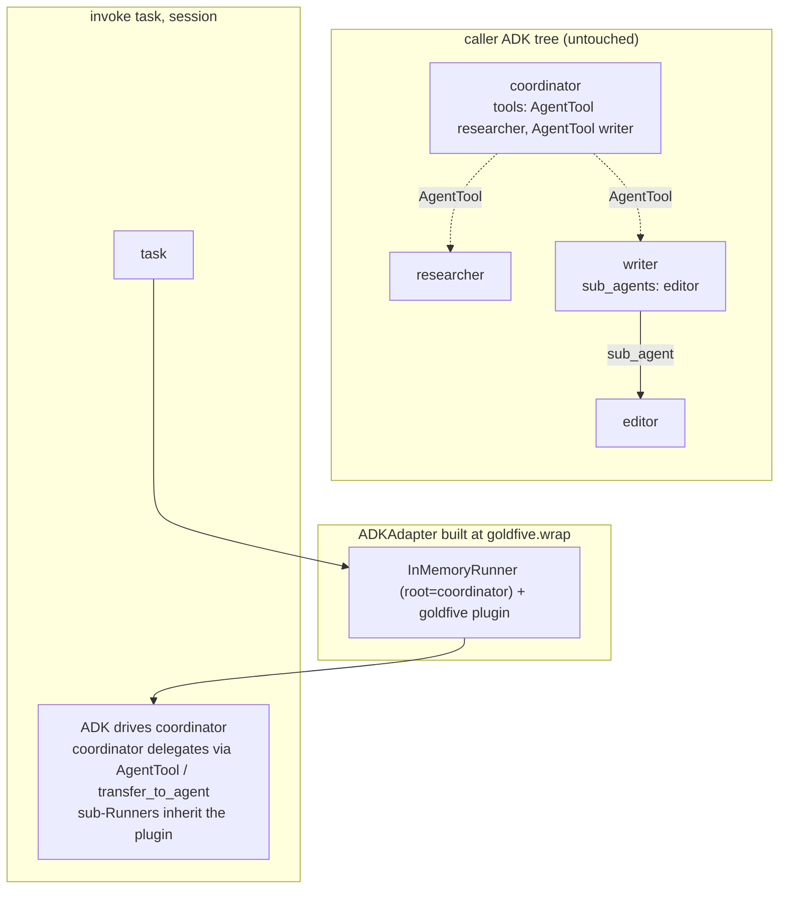

# goldfive architecture

goldfive is a framework-agnostic harness that wraps an agent and
injects **planning, task tracking, drift analysis, and steering**. The
agent does the thinking; goldfive decides what the agent thinks about
and whether it is still on track.

This document is the top-level architectural reference. It covers the
six primitives, how they compose into a `Runner`, and the full lifecycle
of one `Runner.run()` invocation. Downstream documents go deep on
individual pieces:

- [PROTOCOLS.md](PROTOCOLS.md) — the protocol contracts in detail.
- [VOCABULARY.md](VOCABULARY.md) — exhaustive type-system reference:
  every enum value, every bridge between types.
- [RATIONALE.md](RATIONALE.md) — design-rationale "why" document for
  each major abstraction.
- [EVENT-MODEL.md](EVENT-MODEL.md) — the proto event taxonomy and the
  EventSink contract.
- [DRIFT.md](DRIFT.md) — the drift-kind taxonomy and refine policy.
- [STATE-MACHINE.md](STATE-MACHINE.md) — the task lifecycle state
  diagram.

## The vision

> "Stay on target."

Agents wander. Left alone, a capable LLM agent will often:

- Merge, split, or reorder work in ways the caller did not intend.
- Declare a task "done" when it has only narrated an approach.
- Blow through a context budget and truncate mid-turn.
- Hallucinate artifacts that do not exist.
- Silently abandon the user's real request.

goldfive treats each of these as a **drift** — a structured observation
that execution has diverged from an explicit plan derived from an
explicit goal. Drift is first-class: it is classified, emitted as an
event, and optionally drives a replan.

## The six primitives

| Primitive | Role | Shipped implementations |
|---|---|---|
| `GoalDeriver` | Converts user input into an explicit list of `Goal`s. | `PassthroughGoalDeriver`, `LiteralGoalDeriver`, `LLMGoalDeriver` |
| `Planner` | Produces and refines a `Plan` from goals. | `PassthroughPlanner`, `StaticPlanner`, `LLMPlanner` |
| `Executor` | Drives plan execution task-by-task. | `SequentialExecutor`, `ParallelDAGExecutor` |
| `Steerer` | Owns the task state machine and classifies drift. | `DefaultSteerer` |
| `AgentAdapter` | Wraps a specific agent framework. | `CallableAdapter`, `ADKAdapter`, `ClaudeAgentSDKAdapter` |
| `EventSink` | Receives proto-encoded orchestration events. | `InMemorySink`, `LoggingSink`, `JSONLPersistenceSink`, `SQLitePersistenceSink`, `GRPCSink` |

Each primitive is a `Protocol` (see [PROTOCOLS.md](PROTOCOLS.md)).
goldfive ships default implementations but any conforming class can be
swapped in.

### Primitive responsibilities

**GoalDeriver** — one job: take whatever the caller handed in
(`user_input: str` or a pre-built `list[Goal]`) and return an explicit
list of `Goal`s. Each goal has a `summary` and, optionally, a
`success_predicate: Callable[[Session], bool]` that the executors
evaluate at end-of-run (`evaluate_goal_predicates`,
PLAN-LIFECYCLE.md §6.1): an unmet or raising predicate fails the run.
There is no mid-run consultation.

**Planner** — produces a `Plan` (DAG of `Task`s) from goals, and
revises it on drift via `refine(plan, drift, goals)`. The planner is
the only component that ever decides *what* tasks exist. Executors and
steerers just mechanically walk whatever plan the planner hands them.

**Executor** — drives the run. Two executors ship:
`SequentialExecutor` (the default; supports both the overlay model
and a legacy per-task loop behind `overlay_mode=False`) and
`ParallelDAGExecutor` (per-task; batches independent tasks per
topological stage and runs the stage with `asyncio.gather`). Under
the overlay model the executor calls `adapter.invoke_passthrough(user_input)`
ONCE per run / turn; under the legacy per-task loop it calls
`adapter.invoke(task, session)` per eligible task. See §"Overlay
execution model" below for the overlay flow.

**Steerer** — owns the task state machine. It reacts to reporting tool
calls (from the adapter) and to adapter-observed events, transitions
task status monotonically, and runs drift classification. When drift
crosses a severity threshold it invokes `planner.refine(...)`.

**AgentAdapter** — the only primitive that knows about a specific
agent framework (ADK, Claude Agent SDK, a bare callable, ...). It
registers reporting tools, renders current-task context into whatever
form the framework expects (shared session state, a system prompt,
whatever), invokes the agent, and routes tool calls and observed
events back to the steerer. All adapters funnel reporting-tool
dispatch through the shared
`goldfive.adapters._tool_invocation.invoke_tool` helper, which runs
four guard layers (schema rejection, terminal-task rejection,
per-task loop detection, session-wide volume cap) before calling the
`ReportingToolSpec.handler` — see [TASK-LIFECYCLE.md §5](TASK-LIFECYCLE.md)
for the layering.

**EventSink** — consumes the proto-encoded event stream. goldfive
ships five sinks: `InMemorySink` for tests, `LoggingSink` for dev,
`JSONLPersistenceSink` / `SQLitePersistenceSink` for durable
per-run / cross-run storage, and `GRPCSink` for streaming events to
an out-of-process observer. harmonograf is the canonical external
sink (see the
[harmonograf-integration guide](../guides/harmonograf-integration.md)
and [choosing-a-sink.md](../guides/choosing-a-sink.md)).

## How they compose

```
                                ┌────────────────────────────────────────┐
                                │                Runner                  │
                                │                                        │
          user_input    ─────▶  │  GoalDeriver ─▶ Planner ─▶ Executor   │  ─────▶  ExecutionOutcome
          (str or                │                  ▲            │        │
           list[Goal])           │                  │            ▼        │
                                │       refine(drift, goals)  adapter.   │
                                │                  │          invoke()   │
                                │                  │            │        │
                                │              Steerer ◀────────┘        │
                                │             (drift kinds)              │
                                │                  │                      │
                                │                  ▼                      │
                                │             EventSinks                  │
                                │      (InMemory, Logging, JSONL,         │
                                │       SQLite, gRPC, harmonograf, …)     │
                                └────────────────────────────────────────┘
                                                   │
                                                   ▼
                                    proto Event stream (RunStarted,
                                    PlanSubmitted, TaskStarted, …)
```

**Data direction:**

- `user_input → goals → plan → tasks → invocations`. The "forward"
  pipeline.
- `agent output → steerer observations → drift events → refine(plan)`.
  The "reverse" feedback loop.
- Every state-affecting decision emits an `Event` to every `EventSink`
  in `sinks`. Event emission is fan-out: sinks never see each other.

**Control direction:**

- The `Executor` owns the top-level loop. It calls `adapter.invoke()`
  per task, then asks the `Steerer` whether drift occurred, then — if
  so — calls `Planner.refine()` and swaps in the new plan before the
  next iteration.
- The `Steerer` is passive with respect to control; it classifies and
  transitions, it does not drive execution.

## The `Runner`

`Runner` is the single public entry point. It composes the six
primitives, owns a `Session`, and runs one invocation end-to-end. See
[api.md](../reference/api.md#runner) for the full signature.

Minimal construction:

```python
# pseudo-code: `my_async_callable` and `precomputed_plan` are stand-ins
# for the caller's real agent and plan. Everything else is real.
from goldfive import Runner
from goldfive.adapters.callable import CallableAdapter
from goldfive.planner import StaticPlanner
from goldfive.executors.sequential import SequentialExecutor

runner = Runner(
    agent=CallableAdapter(my_async_callable),
    planner=StaticPlanner(precomputed_plan),
    executor=SequentialExecutor(),
)
outcome = await runner.run("build me a slide deck about Python")
```

When the caller omits `goal_deriver`, `steerer`, or `sinks`, the
`Runner` substitutes sane defaults:

- `goal_deriver` → `PassthroughGoalDeriver("run")` — returns a single
  pre-configured `Goal(id="g1", summary="run")` regardless of the
  `user_input`. Use `LiteralGoalDeriver` (or pass
  `PassthroughGoalDeriver(user_input)`) if you want the input text to
  flow through.
- `steerer` → `DefaultSteerer()`.
- `sinks` → `[]` (events go nowhere; recommended to supply at least
  `InMemorySink` in dev and `JSONLPersistenceSink` /
  `SQLitePersistenceSink` in prod).

For the shortest possible construction, call `goldfive.wrap(agent)`
or `goldfive.quickstart(agent, goals)`. `wrap` auto-detects the
adapter for ADK / Claude SDK / callable agents and wires an
LLM-backed planner when it can detect the agent's model;
`quickstart` returns a `Runner` with a one-task-per-goal static plan
and an `InMemorySink` already configured.

## The full lifecycle

One call to `runner.run(user_input)` walks the following steps. Every
step emits one or more events (see [EVENT-MODEL.md](EVENT-MODEL.md) for
the full taxonomy).

**Event ownership.** The Runner owns the `Run*` lifecycle events —
`RunStarted`, `GoalDerived`, `PlanSubmitted`, and a pre-executor
`RunAborted` when setup fails. Executors own `Task*` events,
`PlanRevised`, and the terminal `RunCompleted` / `RunAborted`. The
steerer owns `DriftDetected` and per-task transitions. Every
emission is a proto `Event` envelope built via the typed factories
in `goldfive.events`.

### 1. Setup

- Generate a fresh `run_id` (`uuid.uuid4().hex`).
- Construct a `Session(run_id=...)`. `Session` holds all live state for
  this invocation.
- Emit `RunStarted(run_id, goal_summary, started_at)`.

### 2. Goal derivation

- If the caller passed a `list[Goal]` directly, skip derivation and
  use it verbatim.
- Otherwise call `goal_deriver.derive(user_input, context=...)`.
- Store the returned `list[Goal]` in `session.goals`.
- Emit `GoalDerived(goals=...)`.

### 3. Plan generation

- Collect `available_agents` from `adapter.available_agents`.
- Call `planner.generate(goals=session.goals, available_agents=..., context=...)`.
- If `None`: abort with `RunAborted(reason="planner returned no plan")`.
- Otherwise: store the `Plan` on `session.plan` and emit
  `PlanSubmitted(plan=...)`.

### 4. Execution loop

Delegated to `executor.run(plan=..., session=..., adapter=..., steerer=..., planner=..., sinks=...)`.

The executor loop (simplified Sequential flow):

```
while session.plan has unfinished tasks:
    for task in topological_order(session.plan):
        if task.status != PENDING: continue
        if any dep of task is not COMPLETED: skip
        steerer.transition(task.id, RUNNING, session=session)
        result = await adapter.invoke(task, session)    # agent runs here
        # adapter has been forwarding reporting-tool calls through
        # invoke_tool (four-layer guard) to the steerer throughout.
        drift = steerer.detect_drift(result, session)
        if drift and drift.severity >= WARNING:
            revised = await planner.refine(plan=session.plan, drift=drift, goals=session.goals)
            if revised:
                # PlanRevised carries a PlanRevisionDiff sidecar
                # (added / removed / modified task ids + edges).
                session.plan = revised
                emit PlanRevised(plan=revised, diff=<PlanRevisionDiff>, …)
                break to outer loop  # restart walk with revised plan
            else:
                # register (drift_kind, task_id) refine failure;
                # 2 consecutive failures → mark task FAILED and emit
                # CRITICAL REPEATED_FAILURE drift. See PLAN-LIFECYCLE.md §4.5.
```

Cancellation and unrecoverable drift fan out to downstream tasks
through the shared `Steerer.cascade_cancel_downstream(session, id)`
primitive — both cascades emit the same `TaskCancelled` event
stream for the downstream set. See
[PLAN-LIFECYCLE.md §6.2 / §6.3](PLAN-LIFECYCLE.md) and
[STATE-MACHINE.md §"Cascade semantics"](STATE-MACHINE.md).

ParallelDAGExecutor differs only in that each topological *stage* is
an `asyncio.gather` over the stage's tasks; refine runs between
stages, not mid-stage. See [PROTOCOLS.md](PROTOCOLS.md#executor) for
the full contract.

### 5. Termination

One of three terminal events is emitted:

- `RunCompleted(run_id, outcome_summary)` — all tasks reached a
  terminal state and the plan is fully realized.
- `RunAborted(run_id, reason)` — executor surrendered (e.g. hit
  `max_task_invocations` with tasks still PENDING, planner returned
  `None` during refine, unrecoverable drift).
- Exception propagation — uncaught exceptions surface to
  `runner.run()`'s caller. Sinks still receive a `RunAborted` event
  before the exception re-raises.

The `ExecutionOutcome(success, session, reason)` returned to the
caller captures the same information.

### 6. Sink teardown

- `await sink.close()` is called on every sink.
- `JSONLPersistenceSink.close()` is the one that matters most: it
  flushes buffered writes and releases the file lock. See the
  [persistence guide](../guides/persistence-and-recovery.md).

## Overlay execution model

Since the 2026-04 overlay refactor (goldfive#141, PR #148, refined by
#163, #149, #152, #160, #170) goldfive **no longer drives per-task**
for the default code path. The model is observation-driven with soft
intervention:

```
┌──────────────────────────────────────────────────────────────────┐
│ Default path (goldfive.wrap → SequentialExecutor(overlay_mode=1))│
│                                                                  │
│ 1. Single invocation:                                            │
│    adapter.invoke_passthrough(user_input)                        │
│                                                                  │
│ 2. While the tree runs, the ADK plugin emits                     │
│    before_agent / after_agent / before_tool / after_tool         │
│    events. A PlanReconciler consumes the before/after_agent      │
│    pair and maps observed agent transitions onto plan tasks:     │
│      coordinator → (no task claim, host lifecycle marker)         │
│      researcher  → claim first PENDING task assigned to this name │
│      writer      → same, contextual match via invocation chain    │
│      (goldfive#151) if a direct assignee match fails              │
│                                                                  │
│ 3. The GoldfivePlanner (BasePlanner) attached to every LlmAgent  │
│    in the tree injects a per-turn orchestration block into the   │
│    LLM system prompt and classifies every function_call via the  │
│    three-stage gate (own-tool / cross-layer / confabulation).    │
│                                                                  │
│ 4. Drift signals (PLAN_DIVERGENCE, CONFABULATION_RISK,           │
│    LOOPING_REASONING from reasoning + tool_loops detectors,      │
│    INTENT_DIVERGENCE, GOAL_DRIFT, ...) feed the intervention     │
│    ladder (Levels 0-5) in DefaultSteerer._handle_drift.          │
│                                                                  │
│ 5. On USER_STEER:                                                │
│      a. dedup by annotation_id (goldfive#171)                    │
│      b. refine under USER_STEER drift (delete-and-replan)        │
│      c. cancel in-flight adapter.invoke_passthrough              │
│      d. restart invoke_passthrough with framed steer message     │
│         (`_compose_steer_restart_message`, goldfive#152)          │
│                                                                  │
│ 6. Invocation-end sweep:                                         │
│    Any PENDING task the tree never exercised → NOT_NEEDED        │
│    (goldfive#163). No soft follow-up — flow-coordinators         │
│    re-ran their full pipeline on every follow-up user message.   │
│    STEER is the user-driven path for exercising uncovered work. │
└──────────────────────────────────────────────────────────────────┘
```

**Per-task driving is gone** from the default code path. The legacy
per-task loop still lives in `SequentialExecutor.run` behind
`overlay_mode=False` for backward compatibility with direct
`SequentialExecutor(...)` callers and tests.

**Key modules.**

- `goldfive/executors/sequential.py::SequentialExecutor._run_overlay`
  — the overlay loop.
- `goldfive/reconciler.py::PlanReconciler` — observation → task
  transition mapping.
- `goldfive/steerer.py::DefaultSteerer` — the intervention ladder
  (`InterventionLevel.OBSERVE`, `ABSORB`, `NUDGE`,
  `CANCEL_REINVOKE`, `PAUSE_ESCALATE`, `TERMINATE`) plus
  `compose_corrective_user_message` used by Level 3.
- `goldfive/planners/goldfive_planner.py::GoldfivePlanner` —
  `BasePlanner` subclass auto-attached to every LlmAgent.
- `goldfive/adapters/_adk_plugin.py::_GoldfiveADKPlugin` — installs
  once per `InMemoryRunner`, propagates into AgentTool sub-Runners,
  plumbs the plan reconciler's observation hooks and instruments
  `goldfive.llm.request` / `goldfive.llm.response` per-LLM-call
  logs (goldfive#172).

### GoldfivePlanner: structural steering via plugin injection

`GoldfivePlanner` subclasses ADK's `BasePlanner` directly (NOT
`PlanReActPlanner` — see [RATIONALE.md](RATIONALE.md#why-goldfiveplanner-subclasses-baseplanner-not-planreactplanner)).
It has two structural jobs on every LLM call:

1. **Request side** — build a short tree-agnostic orchestration
   block assembled from `session.state["goldfive.*"]` keys (plan
   task, goals, active user steer) and inject it into the
   `llm_request.config.system_instruction`. Because ADK gates native
   request-side instruction injection on
   `isinstance(planner, PlanReActPlanner)`, the `_GoldfiveADKPlugin`'s
   `before_model_callback` takes over the injection whenever it
   detects a `GoldfivePlanner` on the running agent.

2. **Response side** — run the three-stage `function_call`
   classifier (own-tool / cross-layer / confabulation) and strip
   any parts whose id is in
   `session.state["goldfive.cancelled_function_call_ids"]` (post-
   STEER retry suppression). ADK's response-side
   `_NlPlanningResponseProcessor` fires for any `BasePlanner`
   subclass, so this side runs natively.

`goldfive.wrap` auto-attaches a `GoldfivePlanner` instance to every
LlmAgent reachable in the tree (#153/#156). Pre-existing user
planners are preserved via `GoldfivePlanner(user_planner=...)`
composition — the user planner's request-side output is **prepended**
ahead of goldfive's block, and goldfive's response-side filters run
first (cancelled-id strip + divergence signal) before the user
planner sees the remaining parts.

### Orchestration state namespace (goldfive.*)

`Session.state` is a dict goldfive stamps under the `goldfive.*`
prefix (see `goldfive/orchestration_state.py`). It is the framework-
agnostic orchestration surface; the ADK-specific
`_adk_state_protocol` bridges it onto the ADK runtime session.state
so the `GoldfivePlanner` reading from `state["goldfive.current_task_id"]`
sees what the reconciler just wrote.

Key names:

| Key | Owner | Lifecycle |
|---|---|---|
| `goldfive.current_plan_id` | Runner / `_apply_revision` | Set on plan install; persists across the run. |
| `goldfive.current_task_id`, `goldfive.current_task_title` | `PlanReconciler` | Set on RUNNING; cleared on terminal transition + run end. |
| `goldfive.goals_summary` | Runner post-derivation; `_apply_user_steer_state` | Refreshed whenever `session.goals` changes. |
| `goldfive.active_steer.body`, `.at_turn`, `.author` | `DefaultSteerer._apply_user_steer_state` | Durable read-back of the most recent USER_STEER — NOT a cooldown. No-cooldown is a user directive (goldfive#152). |
| `goldfive.processed_steer_ids` | `DefaultSteerer` | Bounded FIFO of processed STEER ids; drives idempotency (goldfive#171). |
| `goldfive.cancelled_function_call_ids` | `ADKAdapter._heal_pending_tool_calls` | Append-only list of function_call ids healed mid-invocation. Consumed by `GoldfivePlanner.process_planning_response` to strip retry attempts. |

**Writers only go through** `goldfive.orchestration_state.write(...)`
which enforces the `goldfive.*` prefix.

### Session unification (three-session alignment, goldfive#161)

Three session ids used to float independently; post-#161 / #164 they
are pinned together:

```
┌──────────────────────────┐    ┌──────────────────────────┐
│ adk-web                  │    │ harmonograf              │
│   InvocationContext      │    │   home session (client)  │
│   .session.id = S        │    │   Hello: session_id=S    │
└─────────┬────────────────┘    └─────────┬────────────────┘
          │                               │
          ▼                               ▼
┌──────────────────────────────────────────────────────────┐
│ goldfive                                                 │
│   Session.id (= run_id) = S   ← pinned by Runner(        │
│                                   session_id=ctx.session.id)│
│                                                           │
│   Every emitted Event carries Event.session_id = S       │
│   (goldfive#155 field 5)                                 │
│                                                           │
│   ADK-side session (_adk_state_protocol) runs in the     │
│   same runtime session; state.goldfive.* writes land on  │
│   the live session the plugin sees.                      │
└──────────────────────────────────────────────────────────┘
```

The `HarmonografSink` routes spans by `ctx.session.id` and goldfive
events by `Event.session_id` (field 5). All three layers reference
the same id, so "plan view / Gantt / event log" line up.

See [RATIONALE.md §"Session unification"](RATIONALE.md#why-session-unification-over-multi-session-rollup)
for the design reasoning.

## Single-Runner dispatch: goldfive drives the root, ADK delegates within

The `AgentAdapter.invoke(task, session)` boundary is deliberately
single-task. For the ADK adapter, that single-task contract meets a
framework that natively supports nested agent *trees* —
`sub_agents`, `inner_agent` wrappers, `transfer_to_agent`, and
`AgentTool`-wrapped specialists exposed to a coordinator as tools.
Goldfive's design principle here is:

> **goldfive drives the tree root; ADK handles delegation within the tree.**

The tree the caller hands to `goldfive.wrap(...)` is **respected,
never rewritten or flattened**. Goldfive builds exactly one
`google.adk.runners.InMemoryRunner` around that tree's root; ADK's
own native mechanisms (AgentTool, `transfer_to_agent`, `sub_agents`)
resolve which sub-agent executes each part of a turn.

### The single runner

On wrap, `ADKAdapter.__init__` builds one `InMemoryRunner` around
the caller-supplied root agent and installs the goldfive plugin on
its plugin manager. Goldfive does not walk the tree to build a
per-agent runner registry — that approach was tried in #120 and
reverted in #130 (see [RATIONALE.md §"Why single-Runner, not registry-dispatch"](RATIONALE.md#why-single-runner-not-registry-dispatch)).

What the adapter *does* do at wrap time:

- `_augment_subtree_with_reporting` walks `sub_agents` /
  `inner_agent` / `AgentTool.agent` edges and attaches the canonical
  reporting tools to every reachable agent. Coverage across the
  tree is critical because an AgentTool sub-invocation can itself
  call `report_task_completed` for the outer task — so every
  reachable agent needs those tools available.
- `_collect_reachable_agent_names` exposes those names as
  `adapter.available_agents`, an advisory list the planner uses to
  populate `task.assignee_agent_id` for observability + delegation
  hints in prompts.
- The goldfive plugin installs on the one runner. ADK propagates
  the plugin manager into `AgentTool`-spawned sub-Runners
  automatically, so the plugin's callbacks fire for every sub-agent
  invocation without a re-registration.

### The shape of a dispatched turn



For every task, goldfive drives the coordinator. The coordinator's
LLM decides whether to run its own body or to delegate via
`AgentTool(writer)` / `transfer_to_agent("editor")`. When it
delegates via AgentTool, ADK spawns a sub-Runner for the writer —
ADK carries the plugin manager through, so the plugin's
`before_run_callback` fires against the writer's live session and
seeds the same `goldfive.current_task_id` / plan context there. The
writer can call `report_task_completed` directly and the outer
task's status updates via the live-session state-protocol writes.

### Termination

An `invoke` returns when any of three conditions hits:

1. The runner's `run_async` generator naturally ends — the
   **authoritative** signal under the single-Runner model.
2. The agent emits an event flagged as ADK's final response.
3. The task's status in `session.plan` has transitioned to a
   terminal status (the agent called `report_task_*`) — early-exit
   optimization so an over-chatty agent doesn't keep driving LLM
   turns on a task it already marked done.

### The AgentTool-per-invoke cap (goldfive#130)

ADK coordinators whose prompts describe a pipeline
("first research, then build, then review…") can enter a
self-delegating loop: every AgentTool call returns, the coordinator
re-reads its instructions, calls the next AgentTool, and so on.
Goldfive cannot require prompt cooperation (users bring their own
trees), so the plugin enforces a per-invocation cap on AgentTool
spawns — default 16, configurable via
`ADKAdapter(agent_tool_cap=N)` (set to 0 to disable).

When a coordinator exceeds the cap, the plugin:

- emits a `RUNAWAY_DELEGATION` drift at CRITICAL severity — routes
  through `steerer._handle_drift` so the planner's `refine` hook
  gets a chance to salvage the run,
- sets a flag that the adapter's invoke loop reads between events
  to break cleanly,
- short-circuits any further AgentTool spawns in the same
  invocation with a "skipped" dict so the agent wraps up quickly.

The cap is NOT a limit on legitimate delegation — a reasonable
coordinator calls a handful of tools and returns. It only catches
the pathology where a mis-prompted coordinator fans out until
ADK's 500-LLM-call ceiling hits.

### Graceful degrade

Callers who hand `goldfive.wrap` an already-built ADK `Runner`
instead of a `BaseAgent` get that runner used verbatim — no
wrapping, no re-construction. `available_agents` reports just the
runner's root agent name (goldfive cannot walk a tree it doesn't
own). The wrap-time plugin-installed integrity check is skipped
because the caller may have passed a runner shape we don't fully
control.

See [RATIONALE.md §"Why single-Runner, not registry-dispatch"](RATIONALE.md#why-single-runner-not-registry-dispatch)
for the design history, and
[EVENT-MODEL.md §"Agent-invocation events"](EVENT-MODEL.md#agent-invocation-events)
for the three observability events the plugin emits on every
dispatch and every AgentTool sub-invocation.

## Invariants

Four invariants hold across every `Runner.run(...)` invocation:

1. **Monotonic task state** — once a task reaches `COMPLETED`,
   `FAILED`, or `CANCELLED`, it cannot transition out. The steerer
   enforces this. See [STATE-MACHINE.md](STATE-MACHINE.md).
2. **Plan revisions preserve history** — `planner.refine()` may add,
   remove, or re-order tasks, but the executor only re-runs tasks that
   have not yet reached a terminal state. Completed work is never
   re-done.
3. **Events are monotonically sequenced** — every event carries
   `sequence = session.next_sequence()`. Sinks can rely on sequence
   order to reconstruct state.
4. **Sinks are side-effect-only** — goldfive never reads from a sink.
   Sinks may be slow, lossy, or remote without affecting correctness.

## What's out of scope for v0.1

- **CLI.** goldfive is a library. Callers build CLIs on top.
- **Multi-run coordination.** One `Runner.run()` = one `run_id`. For
  resuming a crashed run, see [persistence-and-recovery.md](../guides/persistence-and-recovery.md).
- **Streaming to the caller.** `Runner.run()` is a batch call.
  Streaming live progress is expected to happen through a caller-
  supplied `EventSink`, not through an async generator.

**Live steering is in-box.** Human-in-the-loop mid-run steering
(PAUSE, RESUME, CANCEL, STEER, REWIND_TO, APPROVE, REJECT,
STATUS_QUERY, INTERCEPT_TRANSFER, INJECT_MESSAGE) is implemented.
Pass a `ControlChannel` to `Runner(control=...)` and an external
process can drive the run through it. STEER is idempotent by
`annotation_id` (goldfive#171). The intervention ladder
(`DefaultSteerer`) classifies drift into one of six levels (OBSERVE /
ABSORB / NUDGE / CANCEL_REINVOKE / PAUSE_ESCALATE / TERMINATE) so
"when does goldfive interrupt the tree" is a single table. See
[CONTROL.md](CONTROL.md) for the wire format, [DRIFT.md](DRIFT.md)
for the ladder, and
[`examples/live_steering.py`](../../examples/live_steering.py) for
a runnable demo.

## Layering: goldfive inside, harmonograf outside

goldfive and [harmonograf](https://github.com/pedapudi/harmonograf) are
two cooperating layers, not one product split awkwardly in two.
Understanding the boundary between them keeps contributions on the
right side of the line.

```
┌─────────────────────────────────────────────────────────────┐
│ harmonograf (observability + UI)                            │
│                                                             │
│  - harmonograf server — gRPC ingest of Event streams        │
│  - harmonograf UI — React console for live runs             │
│  - harmonograf_client.observe(runner) — attaches a Sink +   │
│    an optional ControlChannel bridge for live steering      │
│                                                             │
│  Reads: proto Event stream (via GRPCSink or HarmonografSink)│
│  Writes back: ControlMessages into goldfive.ControlChannel  │
└──────────────────────┬──────────────────────────────────────┘
                       │   Event stream ▲    Control msgs ▼
                       │                │                 │
┌──────────────────────▼─────────────────────────────────────┐
│ goldfive (orchestration: planning, steering, dispatch)     │
│                                                            │
│  - Runner / Executor / Steerer / Planner / Adapter / Sink  │
│  - Runs one Session against one Plan                       │
│  - Emits proto Events on every state change                │
│  - Accepts ControlMessages on an optional ControlChannel   │
│                                                            │
│  Knows nothing about: UI frameworks, dashboards, gRPC      │
│  servers, React, harmonograf proto                         │
└────────────────────────────────────────────────────────────┘
```

**Invariants:**

- **goldfive never imports harmonograf.** Every observer-side concern
  is implementable against the public `EventSink` and `ControlChannel`
  primitives.
- **harmonograf never edits goldfive's Session.** Control flows only
  through `ControlChannel.send()`; state mutation only happens inside
  goldfive (via the Steerer).
- **Events are the contract.** A proto `Event` written against the v1
  schema is readable by both layers; future versions add fields only.

**`wrap` vs `observe`.** Two orthogonal verbs:

- `goldfive.wrap(agent, ...)` — wraps an agent as an adapter + picks a
  planner/deriver/executor/steerer. *Inside* goldfive's layer.
- `harmonograf_client.observe(runner, ...)` — attaches a sink (and
  optionally a control bridge) to a `Runner`. *Outside* goldfive's
  layer.

Callers often use both: `runner = goldfive.wrap(agent); observe(runner)`.

For the full "why" behind this split, see
[RATIONALE.md §"Why harmonograf is a sink rather than an executor
plugin"](RATIONALE.md#why-harmonograf-is-a-sink-rather-than-an-executor-plugin).
For the type-system view of what flows across the boundary, see
[VOCABULARY.md](VOCABULARY.md).

## Reading order

If you're new, read this doc in order with:

1. [VOCABULARY.md](VOCABULARY.md) — the vocabulary (enums, types,
   bridges) the rest of the docs assume.
2. [PROTOCOLS.md](PROTOCOLS.md) — the shape contracts.
3. [STATE-MACHINE.md](STATE-MACHINE.md) — how one task moves through
   the lifecycle.
4. [DRIFT.md](DRIFT.md) — what counts as drift and what to do about it.
5. [EVENT-MODEL.md](EVENT-MODEL.md) — how observability flows out.
6. [RATIONALE.md](RATIONALE.md) — why each piece is the way it is.

For hands-on, jump to [getting-started.md](../guides/getting-started.md).
