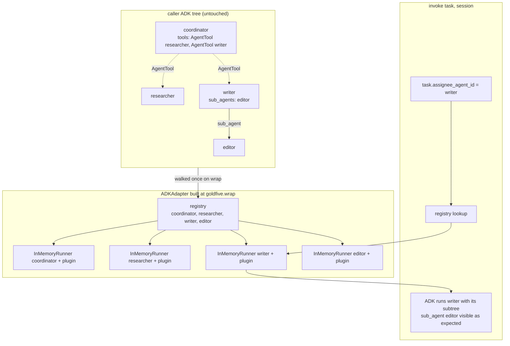

# goldfive architecture

goldfive is a framework-agnostic harness that wraps an agent and
injects **planning, task tracking, drift analysis, and steering**. The
agent does the thinking; goldfive decides what the agent thinks about
and whether it is still on track.

This document is the top-level architectural reference. It covers the
six primitives, how they compose into a `Runner`, and the full lifecycle
of one `Runner.run()` invocation. Downstream documents go deep on
individual pieces:

- [PROTOCOLS.md](PROTOCOLS.md) — the protocol contracts in detail.
- [VOCABULARY.md](VOCABULARY.md) — exhaustive type-system reference:
  every enum value, every bridge between types.
- [RATIONALE.md](RATIONALE.md) — design-rationale "why" document for
  each major abstraction.
- [EVENT-MODEL.md](EVENT-MODEL.md) — the proto event taxonomy and the
  EventSink contract.
- [DRIFT.md](DRIFT.md) — the drift-kind taxonomy and refine policy.
- [STATE-MACHINE.md](STATE-MACHINE.md) — the task lifecycle state
  diagram.

## The vision

> "Stay on target."

Agents wander. Left alone, a capable LLM agent will often:

- Merge, split, or reorder work in ways the caller did not intend.
- Declare a task "done" when it has only narrated an approach.
- Blow through a context budget and truncate mid-turn.
- Hallucinate artifacts that do not exist.
- Silently abandon the user's real request.

goldfive treats each of these as a **drift** — a structured observation
that execution has diverged from an explicit plan derived from an
explicit goal. Drift is first-class: it is classified, emitted as an
event, and optionally drives a replan.

## The six primitives

| Primitive | Role | Shipped implementations |
|---|---|---|
| `GoalDeriver` | Converts user input into an explicit list of `Goal`s. | `PassthroughGoalDeriver`, `LiteralGoalDeriver`, `LLMGoalDeriver` |
| `Planner` | Produces and refines a `Plan` from goals. | `PassthroughPlanner`, `StaticPlanner`, `LLMPlanner` |
| `Executor` | Drives plan execution task-by-task. | `SequentialExecutor`, `ParallelDAGExecutor` |
| `Steerer` | Owns the task state machine and classifies drift. | `DefaultSteerer` |
| `AgentAdapter` | Wraps a specific agent framework. | `CallableAdapter`, `ADKAdapter`, `ClaudeAgentSDKAdapter` |
| `EventSink` | Receives proto-encoded orchestration events. | `InMemorySink`, `LoggingSink`, `JSONLPersistenceSink`, `SQLitePersistenceSink`, `GRPCSink` |

Each primitive is a `Protocol` (see [PROTOCOLS.md](PROTOCOLS.md)).
goldfive ships default implementations but any conforming class can be
swapped in.

### Primitive responsibilities

**GoalDeriver** — one job: take whatever the caller handed in
(`user_input: str` or a pre-built `list[Goal]`) and return an explicit
list of `Goal`s. Each goal has a `summary` and, optionally, a
`success_predicate: Callable[[Session], bool]` that the framework can
consult to decide "are we done yet?".

**Planner** — produces a `Plan` (DAG of `Task`s) from goals, and
revises it on drift via `refine(plan, drift, goals)`. The planner is
the only component that ever decides *what* tasks exist. Executors and
steerers just mechanically walk whatever plan the planner hands them.

**Executor** — walks the plan. Two executors ship in v0.1:
`SequentialExecutor` runs tasks one at a time in topological order;
`ParallelDAGExecutor` batches independent tasks per topological stage
and runs the stage with `asyncio.gather`. The executor is the only
component that calls `adapter.invoke(task, session)`.

**Steerer** — owns the task state machine. It reacts to reporting tool
calls (from the adapter) and to adapter-observed events, transitions
task status monotonically, and runs drift classification. When drift
crosses a severity threshold it invokes `planner.refine(...)`.

**AgentAdapter** — the only primitive that knows about a specific
agent framework (ADK, Claude Agent SDK, a bare callable, ...). It
registers reporting tools, renders current-task context into whatever
form the framework expects (shared session state, a system prompt,
whatever), invokes the agent, and routes tool calls and observed
events back to the steerer. All adapters funnel reporting-tool
dispatch through the shared
`goldfive.adapters._tool_invocation.invoke_tool` helper, which runs
four guard layers (schema rejection, terminal-task rejection,
per-task loop detection, session-wide volume cap) before calling the
`ReportingToolSpec.handler` — see [TASK-LIFECYCLE.md §5](TASK-LIFECYCLE.md)
for the layering.

**EventSink** — consumes the proto-encoded event stream. goldfive
ships five sinks: `InMemorySink` for tests, `LoggingSink` for dev,
`JSONLPersistenceSink` / `SQLitePersistenceSink` for durable
per-run / cross-run storage, and `GRPCSink` for streaming events to
an out-of-process observer. harmonograf is the canonical external
sink (see the
[harmonograf-integration guide](../guides/harmonograf-integration.md)
and [choosing-a-sink.md](../guides/choosing-a-sink.md)).

## How they compose

```
                                ┌────────────────────────────────────────┐
                                │                Runner                  │
                                │                                        │
          user_input    ─────▶  │  GoalDeriver ─▶ Planner ─▶ Executor   │  ─────▶  ExecutionOutcome
          (str or                │                  ▲            │        │
           list[Goal])           │                  │            ▼        │
                                │       refine(drift, goals)  adapter.   │
                                │                  │          invoke()   │
                                │                  │            │        │
                                │              Steerer ◀────────┘        │
                                │             (drift kinds)              │
                                │                  │                      │
                                │                  ▼                      │
                                │             EventSinks                  │
                                │      (InMemory, Logging, JSONL,         │
                                │       SQLite, gRPC, harmonograf, …)     │
                                └────────────────────────────────────────┘
                                                   │
                                                   ▼
                                    proto Event stream (RunStarted,
                                    PlanSubmitted, TaskStarted, …)
```

**Data direction:**

- `user_input → goals → plan → tasks → invocations`. The "forward"
  pipeline.
- `agent output → steerer observations → drift events → refine(plan)`.
  The "reverse" feedback loop.
- Every state-affecting decision emits an `Event` to every `EventSink`
  in `sinks`. Event emission is fan-out: sinks never see each other.

**Control direction:**

- The `Executor` owns the top-level loop. It calls `adapter.invoke()`
  per task, then asks the `Steerer` whether drift occurred, then — if
  so — calls `Planner.refine()` and swaps in the new plan before the
  next iteration.
- The `Steerer` is passive with respect to control; it classifies and
  transitions, it does not drive execution.

## The `Runner`

`Runner` is the single public entry point. It composes the six
primitives, owns a `Session`, and runs one invocation end-to-end. See
[api.md](../reference/api.md#runner) for the full signature.

Minimal construction:

```python
# pseudo-code: `my_async_callable` and `precomputed_plan` are stand-ins
# for the caller's real agent and plan. Everything else is real.
from goldfive import Runner
from goldfive.adapters.callable import CallableAdapter
from goldfive.planner import StaticPlanner
from goldfive.executors.sequential import SequentialExecutor

runner = Runner(
    agent=CallableAdapter(my_async_callable),
    planner=StaticPlanner(precomputed_plan),
    executor=SequentialExecutor(),
)
outcome = await runner.run("build me a slide deck about Python")
```

When the caller omits `goal_deriver`, `steerer`, or `sinks`, the
`Runner` substitutes sane defaults:

- `goal_deriver` → `PassthroughGoalDeriver("run")` — returns a single
  pre-configured `Goal(id="g1", summary="run")` regardless of the
  `user_input`. Use `LiteralGoalDeriver` (or pass
  `PassthroughGoalDeriver(user_input)`) if you want the input text to
  flow through.
- `steerer` → `DefaultSteerer()`.
- `sinks` → `[]` (events go nowhere; recommended to supply at least
  `InMemorySink` in dev and `JSONLPersistenceSink` /
  `SQLitePersistenceSink` in prod).

For the shortest possible construction, call `goldfive.wrap(agent)`
or `goldfive.quickstart(agent, goals)`. `wrap` auto-detects the
adapter for ADK / Claude SDK / callable agents and wires an
LLM-backed planner when it can detect the agent's model;
`quickstart` returns a `Runner` with a one-task-per-goal static plan
and an `InMemorySink` already configured.

## The full lifecycle

One call to `runner.run(user_input)` walks the following steps. Every
step emits one or more events (see [EVENT-MODEL.md](EVENT-MODEL.md) for
the full taxonomy).

**Event ownership.** The Runner owns the `Run*` lifecycle events —
`RunStarted`, `GoalDerived`, `PlanSubmitted`, and a pre-executor
`RunAborted` when setup fails. Executors own `Task*` events,
`PlanRevised`, and the terminal `RunCompleted` / `RunAborted`. The
steerer owns `DriftDetected` and per-task transitions. Every
emission is a proto `Event` envelope built via the typed factories
in `goldfive.events`.

### 1. Setup

- Generate a fresh `run_id` (`uuid.uuid4().hex`).
- Construct a `Session(run_id=...)`. `Session` holds all live state for
  this invocation.
- Emit `RunStarted(run_id, goal_summary, started_at)`.

### 2. Goal derivation

- If the caller passed a `list[Goal]` directly, skip derivation and
  use it verbatim.
- Otherwise call `goal_deriver.derive(user_input, context=...)`.
- Store the returned `list[Goal]` in `session.goals`.
- Emit `GoalDerived(goals=...)`.

### 3. Plan generation

- Collect `available_agents` from `adapter.available_agents`.
- Call `planner.generate(goals=session.goals, available_agents=..., context=...)`.
- If `None`: abort with `RunAborted(reason="planner returned no plan")`.
- Otherwise: store the `Plan` on `session.plan` and emit
  `PlanSubmitted(plan=...)`.

### 4. Execution loop

Delegated to `executor.run(plan=..., session=..., adapter=..., steerer=..., planner=..., sinks=...)`.

The executor loop (simplified Sequential flow):

```
while session.plan has unfinished tasks:
    for task in topological_order(session.plan):
        if task.status != PENDING: continue
        if any dep of task is not COMPLETED: skip
        steerer.transition(task.id, RUNNING, session=session)
        result = await adapter.invoke(task, session)    # agent runs here
        # adapter has been forwarding reporting-tool calls through
        # invoke_tool (four-layer guard) to the steerer throughout.
        drift = steerer.detect_drift(result, session)
        if drift and drift.severity >= WARNING:
            revised = await planner.refine(plan=session.plan, drift=drift, goals=session.goals)
            if revised:
                # PlanRevised carries a PlanRevisionDiff sidecar
                # (added / removed / modified task ids + edges).
                session.plan = revised
                emit PlanRevised(plan=revised, diff=<PlanRevisionDiff>, …)
                break to outer loop  # restart walk with revised plan
            else:
                # register (drift_kind, task_id) refine failure;
                # 2 consecutive failures → mark task FAILED and emit
                # CRITICAL REPEATED_FAILURE drift. See PLAN-LIFECYCLE.md §4.5.
```

Cancellation and unrecoverable drift fan out to downstream tasks
through the shared `Steerer.cascade_cancel_downstream(session, id)`
primitive — both cascades emit the same `TaskCancelled` event
stream for the downstream set. See
[PLAN-LIFECYCLE.md §6.2 / §6.3](PLAN-LIFECYCLE.md) and
[STATE-MACHINE.md §"Cascade semantics"](STATE-MACHINE.md).

ParallelDAGExecutor differs only in that each topological *stage* is
an `asyncio.gather` over the stage's tasks; refine runs between
stages, not mid-stage. See [PROTOCOLS.md](PROTOCOLS.md#executor) for
the full contract.

### 5. Termination

One of three terminal events is emitted:

- `RunCompleted(run_id, outcome_summary)` — all tasks reached a
  terminal state and the plan is fully realized.
- `RunAborted(run_id, reason)` — executor surrendered (e.g. hit
  `max_task_invocations` with tasks still PENDING, planner returned
  `None` during refine, unrecoverable drift).
- Exception propagation — uncaught exceptions surface to
  `runner.run()`'s caller. Sinks still receive a `RunAborted` event
  before the exception re-raises.

The `ExecutionOutcome(success, session, reason)` returned to the
caller captures the same information.

### 6. Sink teardown

- `await sink.close()` is called on every sink.
- `JSONLPersistenceSink.close()` is the one that matters most: it
  flushes buffered writes and releases the file lock. See the
  [persistence guide](../guides/persistence-and-recovery.md).

## Registry dispatch: goldfive drives, ADK executes

The `AgentAdapter.invoke(task, session)` boundary is deliberately
single-task. For the ADK adapter, that single-task contract meets a
framework that natively supports nested agent *trees* —
`sub_agents`, `inner_agent` wrappers, and `AgentTool`-wrapped
specialists exposed to a coordinator as tools. Goldfive's design
principle here is uncompromising:

> **goldfive is the dispatch layer; ADK is the execution layer.**

The tree the caller hands to `goldfive.wrap(...)` is **respected,
never rewritten or flattened**. Goldfive's executor picks which
agent runs for each task; ADK runs whatever agent it was handed
with its full subtree intact.

### The registry

On wrap, `ADKAdapter.__init__` walks the tree from the root and
builds a `name -> BaseAgent` registry covering every reachable
agent. The traversal follows three edges:

- `agent.sub_agents` — native ADK child agents.
- `agent.inner_agent` — wrapper agents that compose a single child.
- `tool.agent` for every tool in `agent.tools` — agent-as-tool
  (`AgentTool`) wrappers.

Values in the registry are **references** to the caller's original
agent objects. No copies, no flattening — a coordinator that has
three `AgentTool` specialists as tools still has those tools after
wrap, and the specialists themselves still carry their own
`sub_agents` subtrees. The registry is strictly a discovery surface.

Two wrap-time integrity checks make the registry a hard contract:

- Duplicate agent names raise `ValueError("duplicate agent name in
  tree: <name>")` at construction. The registry keys on name, so a
  duplicate makes strict-match dispatch ambiguous.
- Every reachable agent must carry the canonical reporting tools
  after `register_reporting_tools` — otherwise a task dispatched to
  that agent could not report terminal status back to goldfive.
- Every per-agent `Runner` must have the goldfive plugin installed;
  a runner without the plugin cannot emit state writes, reporting
  callbacks, or drift observations.

### Per-agent runners

Each registered agent gets its own `google.adk.runners.InMemoryRunner`.
The goldfive plugin is installed once per per-agent runner at
construction. `invoke(task, session)` dispatches by looking up
`task.assignee_agent_id` in the registry, picking the per-agent
runner for that agent, and driving **that** runner — not always the
tree root.

An empty `task.assignee_agent_id` falls back to the wrap-target
root's runner, preserving the single-agent wrap contract. An
assignee that is set but missing from the registry raises
`ValueError("plan assigned task <id> to unknown agent <name>;
available: [...]")` so planner bugs fail loud instead of silently
dispatching to the wrong agent.

### The shape of a dispatched turn



In the example, goldfive dispatches the current task to `writer`.
ADK drives the writer runner; the writer's `sub_agents` (here
`editor`) are still available to the writer's invocation exactly as
the caller authored them. If the writer calls
`AgentTool(something)`, ADK's own plugin-inheritance mechanism
carries the goldfive plugin into the spawned sub-runner — so every
nested invocation still emits the same state-protocol keys and
observability events.

### Graceful degrade

Callers who hand `goldfive.wrap` an already-built ADK `Runner`
instead of a `BaseAgent` get a single-entry registry pointing at
the runner's root agent, and a one-time WARNING log:
`ADKAdapter: caller passed a pre-built Runner; per-task-assignee
dispatch is unavailable, all tasks will invoke the runner's
root_agent`. Every dispatch targets that one runner regardless of
`task.assignee_agent_id`. This is a compatibility shim for callers
who constructed their own runner; the full registry model requires
handing in the tree root directly.

See [RATIONALE.md §"Why per-agent runners, not always-root-dispatch"](RATIONALE.md#why-per-agent-runners-not-always-root-dispatch)
for why the single-runner design was rejected, and
[EVENT-MODEL.md §"Agent-invocation events"](EVENT-MODEL.md#agent-invocation-events)
for the three observability events the plugin emits on every
dispatch.

## Invariants

Four invariants hold across every `Runner.run(...)` invocation:

1. **Monotonic task state** — once a task reaches `COMPLETED`,
   `FAILED`, or `CANCELLED`, it cannot transition out. The steerer
   enforces this. See [STATE-MACHINE.md](STATE-MACHINE.md).
2. **Plan revisions preserve history** — `planner.refine()` may add,
   remove, or re-order tasks, but the executor only re-runs tasks that
   have not yet reached a terminal state. Completed work is never
   re-done.
3. **Events are monotonically sequenced** — every event carries
   `sequence = session.next_sequence()`. Sinks can rely on sequence
   order to reconstruct state.
4. **Sinks are side-effect-only** — goldfive never reads from a sink.
   Sinks may be slow, lossy, or remote without affecting correctness.

## What's out of scope for v0.1

- **CLI.** goldfive is a library. Callers build CLIs on top.
- **Multi-run coordination.** One `Runner.run()` = one `run_id`. For
  resuming a crashed run, see [persistence-and-recovery.md](../guides/persistence-and-recovery.md).
- **Streaming to the caller.** `Runner.run()` is a batch call.
  Streaming live progress is expected to happen through a caller-
  supplied `EventSink`, not through an async generator.

**Live steering is in-box.** Human-in-the-loop mid-run steering
(PAUSE, RESUME, CANCEL, STEER, REWIND_TO, APPROVE, REJECT) is
implemented. Pass a `ControlChannel` to `Runner(control=...)` and
an external process can drive the run through it. See
[CONTROL.md](CONTROL.md) for the wire format and
[`examples/live_steering.py`](../../examples/live_steering.py) for
a runnable demo.

## Layering: goldfive inside, harmonograf outside

goldfive and [harmonograf](https://github.com/pedapudi/harmonograf) are
two cooperating layers, not one product split awkwardly in two.
Understanding the boundary between them keeps contributions on the
right side of the line.

```
┌─────────────────────────────────────────────────────────────┐
│ harmonograf (observability + UI)                            │
│                                                             │
│  - harmonograf server — gRPC ingest of Event streams        │
│  - harmonograf UI — React console for live runs             │
│  - harmonograf_client.observe(runner) — attaches a Sink +   │
│    an optional ControlChannel bridge for live steering      │
│                                                             │
│  Reads: proto Event stream (via GRPCSink or HarmonografSink)│
│  Writes back: ControlMessages into goldfive.ControlChannel  │
└──────────────────────┬──────────────────────────────────────┘
                       │   Event stream ▲    Control msgs ▼
                       │                │                 │
┌──────────────────────▼─────────────────────────────────────┐
│ goldfive (orchestration: planning, steering, dispatch)     │
│                                                            │
│  - Runner / Executor / Steerer / Planner / Adapter / Sink  │
│  - Runs one Session against one Plan                       │
│  - Emits proto Events on every state change                │
│  - Accepts ControlMessages on an optional ControlChannel   │
│                                                            │
│  Knows nothing about: UI frameworks, dashboards, gRPC      │
│  servers, React, harmonograf proto                         │
└────────────────────────────────────────────────────────────┘
```

**Invariants:**

- **goldfive never imports harmonograf.** Every observer-side concern
  is implementable against the public `EventSink` and `ControlChannel`
  primitives.
- **harmonograf never edits goldfive's Session.** Control flows only
  through `ControlChannel.send()`; state mutation only happens inside
  goldfive (via the Steerer).
- **Events are the contract.** A proto `Event` written against the v1
  schema is readable by both layers; future versions add fields only.

**`wrap` vs `observe`.** Two orthogonal verbs:

- `goldfive.wrap(agent, ...)` — wraps an agent as an adapter + picks a
  planner/deriver/executor/steerer. *Inside* goldfive's layer.
- `harmonograf_client.observe(runner, ...)` — attaches a sink (and
  optionally a control bridge) to a `Runner`. *Outside* goldfive's
  layer.

Callers often use both: `runner = goldfive.wrap(agent); observe(runner)`.

For the full "why" behind this split, see
[RATIONALE.md §"Why harmonograf is a sink rather than an executor
plugin"](RATIONALE.md#why-harmonograf-is-a-sink-rather-than-an-executor-plugin).
For the type-system view of what flows across the boundary, see
[VOCABULARY.md](VOCABULARY.md).

## Reading order

If you're new, read this doc in order with:

1. [VOCABULARY.md](VOCABULARY.md) — the vocabulary (enums, types,
   bridges) the rest of the docs assume.
2. [PROTOCOLS.md](PROTOCOLS.md) — the shape contracts.
3. [STATE-MACHINE.md](STATE-MACHINE.md) — how one task moves through
   the lifecycle.
4. [DRIFT.md](DRIFT.md) — what counts as drift and what to do about it.
5. [EVENT-MODEL.md](EVENT-MODEL.md) — how observability flows out.
6. [RATIONALE.md](RATIONALE.md) — why each piece is the way it is.

For hands-on, jump to [getting-started.md](../guides/getting-started.md).
