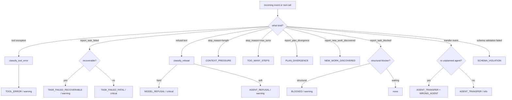

# Drift

A **drift** is a structured observation that execution has diverged
from the plan. goldfive treats drift as first-class: it has a
taxonomy, a severity, a classification function, and a refine policy
that decides whether to replan.

This document enumerates every drift kind, covers classification
rules, and explains when `planner.refine(...)` runs.

Related: [ARCHITECTURE.md](ARCHITECTURE.md#control-direction),
[STATE-MACHINE.md](STATE-MACHINE.md), [PROTOCOLS.md](PROTOCOLS.md#steerer),
[VOCABULARY.md §5 — DriftKind taxonomy](VOCABULARY.md#5-driftkind-taxonomy)
(the authoritative per-kind reference; this doc covers classification
logic and severity bands),
[RATIONALE.md §"Why drift severity is a 3-level enum"](RATIONALE.md#why-drift-severity-is-a-3-level-enum-infowarningcritical-not-a-number).

## The `DriftEvent` shape

```python
# pseudo-code: reproduces the live ``DriftEvent`` dataclass in
# ``goldfive/types.py`` for reference.
@dataclasses.dataclass
class DriftEvent:
    kind: DriftKind          # one of 25+ enum values
    severity: DriftSeverity  # info | warning | critical
    detail: str = ""
    current_task_id: str = ""
    current_agent_id: str = ""
    raw: Any = None          # original trigger (event, exception, tool call)
```

`kind` and `severity` together determine whether refine runs. `detail`
is the human-readable one-liner that flows through to the UI / logs /
planner prompt. `current_task_id` and `current_agent_id` are filled in
from `session` at emission time. `raw` is the trigger — a tool error,
an adapter-streamed block, a reporting-tool call — preserved for
post-hoc analysis.

## Severity levels

Three severities, as a `StrEnum`:

| Severity | Meaning | Refine behavior |
|---|---|---|
| `info` | Noise-level — visible in the event stream, does not trigger refine. | no refine |
| `warning` | The plan should adapt; refine runs. | refine triggered |
| `critical` | Either refine urgently, or the run cannot recover. | refine triggered; may surface as `RunAborted` |

The default refine policy is simple: **any drift of severity
`warning` or above triggers `planner.refine(...)`**. Customizing the
threshold is a matter of subclassing `DefaultSteerer` and overriding
`should_refine(drift) -> bool`.

## The taxonomy

All kinds live in the `DriftKind` `StrEnum`. Mirrors harmonograf where
analogous (goldfive owns the canonical list from v0.1 forward). The
kinds group naturally into six categories.

### Error category — the agent or a tool failed

| Kind | Trigger | Default severity | Recoverable |
|---|---|---|---|
| `TOOL_ERROR` | Adapter observed a tool raising an exception or returning an error payload. | `warning` | yes |
| `AGENT_REFUSAL` | LLM refused to proceed; severity graded by tier — `info` for hedging ("I'm not confident"), `warning` for capability refusals ("I can't help with that"), `critical` for policy/safety refusals ("I must decline"). | tiered (`info`/`warning`/`critical`) | usually (INFO is observational, WARNING retries via refine, CRITICAL typically not) |
| `MODEL_REFUSAL` | Hard refusal — safety-filter style. | `critical` | no |
| `SAFETY_CONCERN` | Detected content policy / safety trigger from the model. | `critical` | no |
| `TASK_FAILED_RECOVERABLE` | `report_task_failed(task_id, reason, recoverable=True)` | `warning` | yes |
| `TASK_FAILED_FATAL` | `report_task_failed(task_id, reason, recoverable=False)` | `critical` | no |
| `REPEATED_FAILURE` | Same task has now failed `>= N` times in one run. | `critical` | sometimes |
| `TASK_TIMEOUT` | Task exceeded its predicted duration by a wide factor. | `warning` | yes |

### Divergence category — work no longer matches the plan

| Kind | Trigger | Default severity | Recoverable |
|---|---|---|---|
| `PLAN_DIVERGENCE` | `report_plan_divergence(note, suggested_action)` | `warning` | yes |
| `STOPPED_EARLY` | Agent stopped emitting before marking the task terminal. | `warning` | yes |
| `TOO_MANY_STEPS` | Adapter observed an unreasonable step count in a single invocation. | `warning` | yes |
| `UNEXPECTED_OUTPUT` | Output did not match a caller-supplied schema / heuristic. | `warning` | yes |
| `SCHEMA_VIOLATION` | Structured output failed validation. | `warning` | yes |
| `HALLUCINATION_SUSPECTED` | Output references entities the session never produced. | `warning` | yes |

### Structural category — the agent or the plan is shaped wrong

| Kind | Trigger | Default severity | Recoverable |
|---|---|---|---|
| `WRONG_AGENT` | Reporting tool call came from an agent that is not `task.assignee_agent_id`. | `warning` | yes |
| `AGENT_TRANSFER` | Adapter observed a transfer / delegation to an unplanned agent. | `info` | yes |
| `CONTEXT_PRESSURE` | Adapter observed a `finish_reason` indicating the context window was hit. | `warning` | yes |
| `RESOURCE_EXHAUSTED` | Adapter observed rate-limit or quota exhaustion. | `warning` | yes |
| `BLOCKED` | `report_task_blocked(task_id, blocker)` with a structural blocker. | `warning` | sometimes |

### Discovery category — new work that was not in the plan

| Kind | Trigger | Default severity | Recoverable |
|---|---|---|---|
| `NEW_WORK_DISCOVERED` | `report_new_work_discovered(parent_task_id, title, description, assignee)` | `warning` | yes |

### User category — external control signal

| Kind | Trigger | Default severity | Recoverable |
|---|---|---|---|
| `USER_STEER` | Caller synthesized a `DriftEvent` to redirect the run. Carries `annotation_id` on the emitted `DriftDetected` event (#177) for sink-side dedupe with the source annotation. Idempotent by `annotation_id` (#171) — duplicate deliveries of the same STEER are dropped by `DefaultSteerer._is_duplicate_steer`. | `warning` | yes |
| `USER_CANCEL` | Caller cancelled the run. `annotation_id` stamped on the emitted event. | `critical` | no |

### Delegation & planning category — the tree routed work into a shape the plan doesn't endorse

| Kind | Enum value | Trigger | Default severity | Detector location | Steerer response |
|---|---|---|---|---|---|
| `RUNAWAY_DELEGATION` | `35` | ADK coordinator delegated via `AgentTool` more than `ADKAdapter(agent_tool_cap=N)` allows (default 16). | `critical` | `_GoldfiveADKPlugin._emit_runaway_delegation_drift` | Level 3 → Level 4 (cancel + refine; escalate on repeat) |
| `CONFABULATION_RISK` | `34` | Two sources: (a) `GoldfivePlanner.process_planning_response` sees a `function_call` whose name is neither in the running agent's own tools nor in the tree agent registry (pure hallucination, three-stage gate #178); (b) `goldfive.drift.classify_confabulation_risk` spots the cheap structural pattern "task title implies external data access but the agent produced output without calling any tool." | `warning` (three-stage gate) / `info` (structural) | `GoldfivePlanner` or `after_run_callback` | Level 1 → Level 3 on repeat |
| `REFINE_VALIDATION_FAILED` | `36` | `LLMPlanner` exhausted its refine retry budget (attempts 1 & 2 both rejected by the structural validator). Terminal signal. | `critical` | `LLMPlanner._emit_refine_validation_failed` | Level 4 (PAUSE_ESCALATE — steerer deliberately does NOT re-refine) |
| `HUMAN_INTERVENTION_REQUIRED` | `37` | Escalation target emitted by the intervention ladder when Level 4 fires (persistent refine failures, goal drift, repeated critical drift). | `critical` | `DefaultSteerer._dispatch_pause_escalate` | Level 4; repeat → Level 5 (TERMINATE) |
| `GOAL_DRIFT` | `38` | Periodic trajectory-level LLM-judge: every N invocations, classify whether accumulated activity advances `session.goals`. Gated behind `Runner(goal_drift_enabled=...)` + a `goal_drift_call_llm` callable on the steerer. | `critical` | `goldfive.drift.goals.classify_goal_drift` | Level 4 both on first and repeat (refine cannot recover from trajectory-level drift) |

### Goal category — we will not be able to finish

| Kind | Trigger | Default severity | Recoverable |
|---|---|---|---|
| `GOAL_UNREACHABLE` | Planner returned `None` from refine; no further progress possible. | `critical` | no |
| `AMBIGUOUS_INTENT` | Multiple plausible goal interpretations; needs clarification. | `warning` | yes |
| `REFINE_VALIDATION_FAILED` | `LLMPlanner` exhausted its refine retry budget — the LLM's response could not be parsed or pass the structural validator. Emitted via the planner's drift-emitter callback right before the planner falls back to the prior plan (or, for the looping-refine path, the deterministic fail-the-looper plan). The steerer deliberately does NOT trigger another `planner.refine` on this kind (infinite-loop risk); the operator chooses whether to steer again, cancel, or let execution proceed with the fallback. | `critical` | no (terminal signal) |

### Reasoning category — the model's chain-of-thought exposes drift before the tool calls do

These five kinds are emitted by `Steerer.observe_reasoning(text, session)`,
which adapters call once per LLM response that carries reasoning content
(OpenAI `reasoning_content`, Anthropic `thinking` blocks, Google thought
parts). See `goldfive/drift/reasoning.py` for the detector pipeline.

| Kind | Trigger | Default severity | Recoverable |
|---|---|---|---|
| `LOOPING_REASONING` | Consecutive reasoning blocks share the same SHA-256 prefix (always-on) or cosine-similar above `0.9` (opt-in, `goldfive[embedding]`). Also fired by the tool-call-loop detector in `goldfive.drift.tool_loops` when the ADK plugin's `after_tool_callback` observes repeated `(tool_name, args_hash)` patterns (exact / name / alternating) — see goldfive#181 and the graduated-severity table in goldfive#204. | `info` · `warning` · `critical` (graduated per tool category + count; `info` for the alternating-cycle variant) | yes |
| `REASONING_CLUSTER_TIGHTENING` | Max cosine similarity between current reasoning and the last N=5 blocks falls in `[0.75, 0.9)` (opt-in, `goldfive[embedding]`). Graduated early-warning tier below the `LOOPING_REASONING` cliff. One-shot per task. | `info` | yes |
| `CONFUSION` | Reasoning text has ≥ 3 uncertainty markers ("I'm not sure", "wait", "hmm", …). | `info` | yes |
| `OFF_TOPIC` | Reasoning cosine-distance from the current task description ≥ `0.7` (requires `goldfive[embedding]`). | `warning` | yes |
| `INTENT_DIVERGENCE` | Reasoning has drifted from `session.goals` + the current task topic. Severity is **graduated** — see table below. | `info` · `warning` · `critical` | depends on severity |

Each observation produces at most one drift (the first match wins) in
severity order: `INTENT_DIVERGENCE` → `LOOPING_REASONING` →
`REASONING_CLUSTER_TIGHTENING` → `OFF_TOPIC` → `CONFUSION`. Detectors
short-circuit so the pipeline cost stays bounded regardless of
reasoning block size. `INTENT_DIVERGENCE` runs first even when it
resolves to `info` severity, because the kind is stable — callers that
only care about warning-and-up simply filter on the `severity` field.

#### Graduated `INTENT_DIVERGENCE` severity

When the `goldfive[embedding]` extra is installed, the detector
computes cosine similarity between the current reasoning block and
`session.goals` + the current task's `title + description`, then maps
the score into a severity band:

| Cosine similarity | Severity | Meaning |
|---|---|---|
| `sim >= 0.6` | _(no drift)_ | reasoning aligned with goals |
| `0.4 <= sim < 0.6` | `info` | minor drift — surface, don't refine |
| `0.2 <= sim < 0.4` | `warning` | notable drift — refine |
| `sim < 0.2` | `critical` | far off-goal — refine urgently |

When embeddings are unavailable the detector falls back to the
pattern path: an explicit "my goal is X / let's focus on Y / pivot to
Z" phrase whose proposal tokens do not overlap with any goal summary
fires at `warning`.

Either path may be bumped one step (`info` → `warning` → `critical`,
saturating at `critical`) when the reasoning text mentions a 5+ char
non-stopword keyword that is absent from both `session.goals` AND the
current task's `title / description` — a cheap "talking about
something unrelated" signal that catches soft divergence the cosine
score alone may smooth over.

The drift **kind** stays `INTENT_DIVERGENCE` across all severity
bands: callers filtering by kind see one stable signal; the
`severity` field differentiates urgency. Thresholds live in
`goldfive/drift/reasoning.py` as
`INTENT_DIVERGENCE_HEALTHY_SIMILARITY`,
`INTENT_DIVERGENCE_MINOR_SIMILARITY`, and
`INTENT_DIVERGENCE_WARNING_SIMILARITY`.

#### Graduated reasoning-similarity ladder

`LOOPING_REASONING` and `REASONING_CLUSTER_TIGHTENING` together form
a two-rung early-warning ladder on the same underlying signal (cosine
similarity of the current reasoning block against recent history):

| Max cosine | Tier | Fires what |
|---|---|---|
| `>= 0.9` | cliff | `LOOPING_REASONING` (WARNING) — the agent's chain-of-thought is looping; refine. |
| `[0.75, 0.9)` | tightening | `REASONING_CLUSTER_TIGHTENING` (INFO) — blocks are clustering tighter; observational only. One-shot per task so a long tight-cluster run does not flood the stream. |
| `< 0.75` | silent | no drift. |

The INFO tier is deliberately below the WARNING threshold so sinks
(harmonograf UI, custom dashboards) see the signal but
`DefaultSteerer._handle_drift` does not trigger `planner.refine` —
the planner is only woken up once the cliff fires. The INFO tier is
skipped entirely when the current observation would also trip the
cliff (i.e., `LOOPING_REASONING` runs first in the pipeline), so the
two tiers never double-fire on the same observation.

The reasoning channel is additive: adapters that cannot surface
chain-of-thought (e.g. classic GPT-4o) simply never call
`observe_reasoning`, and the other drift paths continue to fire
normally.

**Opt-in embedding model.** Pattern / hash detectors run with zero
extra dependencies. Semantic loop detection and off-topic detection
light up when `sentence-transformers` is installed (via the
`goldfive[embedding]` extra). Model load is lazy — no import cost on
processes that never call `observe_reasoning`.

**Session state.** `Session.reasoning_history` stores the last
`reasoning_history_max` (default 20) reasoning blocks and is what the
loop detector compares against. Memory is bounded: 20 × ~2 KB ≈ 40 KB
per session.

### Reflective self-progress category — the agent assessing itself

Two kinds emitted only when the **opt-in** reflective self-progress
check is enabled (see below). The check is framework-driven: every N
LLM turns (default 15) the steerer asks the model "are you making
forward progress on task X?" and classifies the reply.

| Kind | Trigger | Default severity | Recoverable |
|---|---|---|---|
| `UNCERTAIN_PROGRESS` | Model replied "yes" but with `confidence < 0.5`. | `info` | yes |
| `SELF_REPORTED_STUCK` | Model replied "no" (any confidence). | `warning` | yes |

**Feature gate.** The whole mechanism is off by default. Enable via
`DefaultSteerer(reflective_check_interval=15, reflective_call_llm=my_llm)`.
Operators who don't configure `reflective_call_llm` never trigger it
and pay no LLM cost. The shape of `reflective_call_llm` deliberately
matches `LLMPlanner`'s `call_llm` — `(system_prompt, user_prompt,
model) -> str` — so the same callable can be reused.

**Counter placement.** `DefaultSteerer.note_llm_call(session)` is a
public hook adapters invoke once per LLM invocation; it increments
`session._llm_calls_since_check` and fires the check when the counter
reaches `reflective_check_interval`. The ADK adapter calls it from
`after_model_callback`; adapters that don't ship the hook simply
forgo the reflective signal. The counter is reset on task transition
so the assessment is always scoped to the current task.

**Graceful failure.** If the reflective LLM raises, returns empty
output, or returns unparseable JSON, the steerer emits an INFO
`CUSTOM` drift with detail prefixed `reflective_check_failed:`. The
run is never broken by a bad reflective call — this is an
observability signal, not a gate.

**Why this is graduated-risk.** Observation-based drift detection
(pattern matches, embedding cosine) cannot catch "agent is varying
tool args but not actually advancing" — the behaviour isn't repetitive
enough to match a loop detector and the reasoning content doesn't
contain confusion markers. Asking the model to self-assess is a
powerful signal for that failure mode, but it costs an extra LLM call
per check. Operators opt in when the cost is acceptable.

### Escape hatch

| Kind | Trigger | Default severity |
|---|---|---|
| `CUSTOM` | Caller-supplied drift kind not covered by the enum. Detail carries the real kind as a free-form string. | caller chooses |

`CUSTOM` exists to let external sinks or callers feed domain-specific
drift signals without forcing a proto change. Prefer a named kind
when one fits. The opt-in reflective self-progress check also emits
`CUSTOM` (INFO severity) when the reflective LLM itself fails — sinks
that care can match on the ``reflective_check_failed:`` detail prefix.

## Classification

`DefaultSteerer.detect_drift(event, session) -> DriftEvent | None`
runs after every `adapter.invoke()` completes and during streamed
adapter events (when the adapter supports streaming). It is a pure
function of the event plus session state.

The classification dispatch table:



The helper classifiers live in `goldfive/drift/__init__.py` (the
`goldfive.drift` package; the reasoning-drift pipeline lives in
`goldfive/drift/reasoning.py`):

```python
# pseudo-code: signature-only view. Live definitions are in
# ``goldfive/drift/__init__.py``.
def classify_tool_error(event: Any) -> DriftEvent | None: ...
def classify_refusal(text: Any) -> DriftEvent | None: ...
def classify_stop_reason(reason: Any) -> DriftEvent | None: ...
```

Each helper takes an opaque event/text/reason (harmonograf-ish dicts,
plain strings, or framework-native objects) and returns a
``DriftEvent`` when a signal is recognised or ``None`` otherwise.
Subclasses of `DefaultSteerer` can override any of them to tune
thresholds or add domain-specific signals (for example a
schema-violation classifier of your own).

## Refine policy

When `Steerer.detect_drift()` returns a `DriftEvent`, the executor
decides whether to act on it:

```python
# pseudo-code: `emit_drift_detected` / `emit_run_aborted` /
# `emit_plan_revised` / `drift_is_recoverable` are illustrative
# executor-local helpers. The real call sites live inline in
# ``goldfive/executors/sequential.py`` and
# ``goldfive/executors/parallel.py``.
drift = steerer.detect_drift(result, session)
if drift is None:
    continue
await emit_drift_detected(sinks, drift, session)

if drift.severity == DriftSeverity.INFO:
    continue  # informational; proceed

if not drift_is_recoverable(drift):
    await emit_run_aborted(sinks, reason=f"unrecoverable: {drift.kind}", drift=drift)
    return ExecutionOutcome(success=False, session=session, reason=str(drift.kind))

revised = await planner.refine(plan=session.plan, drift=drift, goals=session.goals)
if revised is None:
    # planner declined to revise — treat as goal-unreachable
    await emit_run_aborted(sinks, reason="planner declined refine", drift=drift)
    return ExecutionOutcome(success=False, session=session, reason="goal_unreachable")

session.plan = revised
await emit_plan_revised(sinks, plan=revised, drift=drift, session=session)
```

Four invariants govern the refine path:

1. **Completed tasks are preserved.** `planner.refine()` implementations
   must not return a plan that deletes or re-runs completed tasks. The
   terminal-task and terminal→terminal-edge preservation rules
   (PLAN-LIFECYCLE §3.1–§3.2) are enforced by `Plan.validate()` on
   every revision install.
2. **Revision metadata is stamped.** The revised plan's
   `revision_reason`, `revision_kind`, `revision_severity`, and
   `revision_index` fields are set by the executor before emission.
   The emitted `PlanRevised` event also carries a `PlanRevisionDiff`
   sidecar (added / removed / modified task ids + edges) so sinks can
   render "what changed" without re-fetching the prior plan.
3. **Refine is throttled.** Multiple drifts of the same kind within
   `DEFAULT_REFINE_THROTTLE_SECONDS` (2s) collapse into one refine
   call. `critical` drifts bypass the throttle.
4. **Refine failures back off.** `session.refine_failure_counts`
   tracks consecutive `planner.refine()` failures per
   `(drift.kind, current_task_id)`. Once the counter crosses
   `DefaultSteerer.REFINE_FAILURE_THRESHOLD` (default `2`), the
   steerer marks the current task FAILED and emits a CRITICAL
   `REPEATED_FAILURE` drift — the run does not loop forever on a
   refine that cannot make progress. The counter resets on a
   successful refine.

## Tool-call drift classification

`GoldfivePlanner.process_planning_response` (see
`goldfive/planners/goldfive_planner.py`) classifies every
`function_call` part an LLM emits via a three-stage gate (PR #184 /
goldfive#178). The gate keys on the currently-running agent's own
`tools` list (read from
`callback_context._invocation_context.agent.tools`) combined with the
tree-wide agent registry plumbed in by `ADKAdapter`. The three stages
cleanly separate "legitimate tool call", "cross-layer delegation
attempt", and "hallucinated tool name" — which the pre-#184
single-stage registry check conflated into `PLAN_DIVERGENCE` and
over-fired on for every legitimate non-registry tool.

| Input shape | Drift kind | Detector location |
|---|---|---|
| `function_call` name in agent's own tools | *(none — legitimate tool call)* | — |
| `function_call` name in tree agent registry but not in this agent's tools (cross-layer) | `PLAN_DIVERGENCE` | `GoldfivePlanner.process_planning_response` |
| `function_call` name nowhere (not a tool, not a known agent) | `CONFABULATION_RISK` | `GoldfivePlanner.process_planning_response` |
| tool returned an error payload or raised | `TOOL_ERROR` | `after_tool_callback` observer |
| tool called in a tight loop | `LOOPING_REASONING` (modes exact/name/alternating) | `goldfive/drift/tool_loops.py::ToolLoopTracker` (PR #186) |
| reasoning-content loop (chain-of-thought identical / similar across blocks) | `LOOPING_REASONING` | `goldfive/drift/reasoning.py` |
| tool misaligned with the current task's intent | `INTENT_DIVERGENCE` / `GOAL_DRIFT` | goal classifier (`goldfive/drift/goals.py`) |

`function_call` names prefixed with `report_` (the reporting-tool
protocol namespace — `report_task_started`, `report_task_completed`,
etc.) are always treated as legitimate regardless of tool-list
contents: they're protocol calls goldfive injects and may not be
reflected in every agent's `tools` list depending on when the
augmentation ran.

Cancelled `function_call` ids (from
`session.state['goldfive.cancelled_function_call_ids']`, populated on
USER_STEER / REPLAN cascade-cancel) are stripped BEFORE the three-
stage classifier runs, so a cancelled part never produces a drift
signal regardless of which stage its name would have fallen in.

All three stages emit signals only — the call is never blocked. The
steerer's intervention ladder (§"Intervention ladder") decides
whether to escalate.

## Tool-call loop detection (`ToolLoopTracker`)

Per-invocation tool-call loop detector in
`goldfive/drift/tool_loops.py` (goldfive#181, landed in PR #186;
graduated severity added in goldfive#204). The ADK plugin's
`after_tool_callback` forwards every tool dispatch — reporting tools,
AgentTool delegations, MCP tools, custom adapter-native tools — into a
`ToolLoopTracker` keyed on `(invocation_id, agent_name)`. Matches fire
a `LOOPING_REASONING` drift; severity depends on mode, count, and
**tool category**.

### Meta-tool vs work-tool classification (goldfive#204)

Not every tool loop is the same. A `report_task_completed × 3` is the
agent *reporting* state it already reported — usually cheap and
idempotent on a healthy handler (goldfive#201 made the handlers
idempotent). A `web_developer_agent × 3` is a *work* loop burning LLM
tokens.

The tracker classifies each tool call via `_classify_tool_category`:

- **`meta`** — progress-reporting / metadata tools. Matches `report_task_*`
  prefixes and `report_awaiting_approval`.
- **`work`** — every other tool (agent delegations, MCP tools,
  adapter-native tools, …).

The same loop pattern fires at **different severity** depending on
category. The tracker walks tiers from highest severity to lowest and
emits ONE drift at the first matching tier — no cascade of
`INFO + WARNING + CRITICAL` on the same window.

### Graduated severity table

| Category | Axis | INFO | WARNING | CRITICAL |
|---|---|---|---|---|
| `meta`   | exact | 3 | 6 | 10 |
| `meta`   | name  | —  | — | —  |
| `work`   | exact | 3 | 3 | 6  |
| `work`   | name  | — | 5 | 7  |

"exact" counts identical `(tool_name, args_hash)` signatures in the
window; "name" counts same-`tool_name`-any-args signatures. Category
is determined per tool — a window containing 3 meta retries **and** 3
work retries classifies each tool independently and picks the highest
severity across tools.

An independent **alternating-cycle** mode still fires INFO when the
last `alternating_threshold=5` calls match an `A,B,A,B,A` pattern
(suppressed when an exact/name drift already fired on the same
window).

Every drift's `raw` dict now carries:

- `category` — `"meta"` or `"work"`.
- `tier` — `"info"` | `"warning"` | `"critical"`.
- `mode` — `"exact"` | `"name"` | `"alternating"`.
- `tool_name`, `count`, `window_len`, `invocation_id` (as before).

Thresholds at the **window size** and alternating length are tunable
via `GOLDFIVE_TOOL_LOOP_WINDOW` / `GOLDFIVE_TOOL_LOOP_ALTERNATING_THRESHOLD`.
The legacy `GOLDFIVE_TOOL_LOOP_EXACT_THRESHOLD` /
`GOLDFIVE_TOOL_LOOP_NAME_THRESHOLD` env vars still work and override
the **work-category WARNING tier** only (preserving pre-#204
single-threshold semantics). The graduated CRITICAL tiers and the
meta-category thresholds are module-level constants (grouped in
`_META_THRESHOLDS` / `_WORK_THRESHOLDS`) pending a follow-up that
exposes them via `ServerConfig`.

### Ladder routing for graduated severity

The intervention ladder (below) routes `LOOPING_REASONING` by
severity:

- **INFO** → Level 0 (`OBSERVE`): record the drift, no plan mutation.
  This is the benign tier — meta-tool retries at count 3 land here.
- **WARNING** → Level 1 (`ABSORB`): call `planner.refine`. Unchanged
  from pre-#204 — work-tool loops at 3+ calls, meta at 6+, work
  name-axis at 5.
- **CRITICAL** first → Level 2 (`NUDGE`): refine **and** queue a soft
  corrective follow-up on `session.pending_nudges` for the overlay
  loop to pick up. Coordinates with the forward-progress work that
  wires nudge consumption.
- **CRITICAL** repeat → Level 4 (`PAUSE_ESCALATE`): if the loop
  survives the nudge and re-fires CRITICAL after
  `REFINE_FAILURE_THRESHOLD` occurrences, escalate to a human pause.

### Task-progress gate

**Task-progress gate.** Mode 2 (name axis) requires "no task progress
in window"; `ToolLoopTracker.on_task_progress(invocation_id,
agent_name)` clears the per-agent buffer whenever a task transitions
to a progress state. A legitimate repeating tool that *completes* its
task (e.g. `read_file read_file read_file → report_task_completed`)
is not flagged because the next observation starts from an empty
window. The plugin gates `on_task_progress` on an acknowledged
success response from the progress-reporting tool (goldfive#192) so
errored `report_task_*` retries still accumulate.

### Isolation

**Isolation.** Each `(invocation_id, agent_name)` gets its own ring
buffer, so parallel AgentTool sub-invocations within one outer
invocation do not cross-contaminate. State is ephemeral to a run —
`clear()` is called from the plugin's `clear_active_context`.

This is complementary to the reporting-tool-scoped
`ToolLoopGuard` (`goldfive/adapters/_tool_loop_guard.py`, TASK-
LIFECYCLE §5) which only covers calls routed through
`invoke_tool`. The `ToolLoopTracker` sees every tool call the ADK
plugin observes.

## Intervention ladder (Levels 0-5)

Drift handling routes through an explicit six-level ladder
(goldfive#142) so "when does goldfive interrupt the tree" is a single
table, not a tangle of conditionals. The live mapping from
`(drift_kind, severity, occurrence_count)` to level is
`DefaultSteerer._LADDER` plus the fallback in
`DefaultSteerer._ladder_level_for`. See `goldfive/steerer.py` for
the authoritative table.

| Level | Name | Action | Typical triggers |
|---|---|---|---|
| **0** | `OBSERVE` | Emit `DriftDetected`; no further action. | Every `INFO` drift. |
| **1** | `ABSORB` | Call `planner.refine`; install the revised plan; continue. | `WARNING` drifts with a known kind (`LOOPING_REASONING`, `LOOPING_TOOL_CALL`, `PLAN_DIVERGENCE`, `TOOL_ERROR`, `AGENT_REFUSAL`, `INTENT_DIVERGENCE`, etc.); CRITICAL first-occurrence of most kinds. |
| **2** | `NUDGE` | Queue a short corrective user message on `session.pending_nudges` for the Runner's overlay loop to pick up at the next invocation boundary. | `LOOPING_REASONING` at CRITICAL (first occurrence) after goldfive#204 — gives the agent a soft corrective prompt before escalating. Also available for caller overrides. |
| **3** | `CANCEL_REINVOKE` | Cancel in-flight invocation; refine; compose a corrective user message via `compose_corrective_user_message` for the overlay loop to re-invoke with. | CRITICAL first-occurrence for most refinable kinds (`PLAN_DIVERGENCE`, `TOOL_ERROR`, `RUNAWAY_DELEGATION`, ...). (`LOOPING_REASONING` CRITICAL-first now routes to Level 2 via goldfive#204.) |
| **4** | `PAUSE_ESCALATE` | Emit `HUMAN_INTERVENTION_REQUIRED`; set `session.paused_for_human_intervention = True`; do NOT call `planner.refine`. Runner blocks until a user `RESUME` / `STEER` arrives. | `GOAL_DRIFT` (first & repeat); `REFINE_VALIDATION_FAILED`; `HUMAN_INTERVENTION_REQUIRED`; `INTENT_DIVERGENCE` at CRITICAL; CRITICAL-repeat of almost every kind. |
| **5** | `TERMINATE` | Run-level abort. Currently only reachable when a Level-4-initiated pause times out and `HUMAN_INTERVENTION_REQUIRED` re-fires as a repeat CRITICAL. | Repeat `HUMAN_INTERVENTION_REQUIRED`. |

**Repeat detection.** Occurrence count per `(drift.kind, task_id)` is
tracked on the session; a drift crosses "repeat" once
`occurrence_count >= DefaultSteerer.REFINE_FAILURE_THRESHOLD`
(default `2`). Most CRITICAL entries have a `(first, repeat)` level
pair so the first critical fire refines, the second escalates.

**Severity-to-level quick map (fallback).** Drifts with no explicit
table entry fall through to:

- `INFO` → `OBSERVE`
- `WARNING` → `ABSORB`
- `CRITICAL` first → `ABSORB`; repeat → `PAUSE_ESCALATE`

Subclasses of `DefaultSteerer` override `_ladder_level_for` to tune
the table without re-implementing `_handle_drift`.

See goldfive#179 (umbrella) for future detection work — additional
detectors will register new rows on `_LADDER` rather than editing the
handler.

## How drifts become events

Every `DriftEvent` produces exactly one `DriftDetected` event in the
proto stream. The event envelope (`goldfive.v1.DriftDetected`)
carries:

- `kind` (field 1) — the `DriftKind` enum value.
- `severity` (field 2) — the `DriftSeverity` enum value.
- `detail` (field 3) — human-readable note.
- `current_task_id` (field 4), `current_agent_id` (field 5) — from
  the session at emission time.
- `annotation_id` (field 6, goldfive#177) — for `USER_STEER` /
  `USER_CANCEL` drifts that rode in on a `ControlMessage` with a
  bridge-supplied annotation id. Empty for drifts goldfive minted
  itself (loop detection, `GOAL_DRIFT`, `CONFABULATION_RISK`, etc.).
  Sinks use this to dedup the drift row against the source annotation
  — without it a single user STEER surfaces as three cards
  (annotation row, `user_steer` drift row, `plan_revised` row) in
  harmonograf's Intervention view.

Per-event `session_id` (#155) is stamped on the outer `Event`
envelope, not inside the drift payload — see
[EVENT-MODEL.md §"Event envelope"](EVENT-MODEL.md#event-envelope).

Note: `recoverable` and `raw_summary` are in-memory fields on the
Python `DriftEvent` dataclass; they are NOT serialized onto the
proto event. The full untouched trigger (`raw`) is not emitted; sinks
that need it should snapshot in-process.

If refine runs and succeeds, the next event in the stream is
`PlanRevised`, whose `revision_kind` / `revision_severity` / `revision_index`
fields echo the drift. Callers reconstructing state from a JSONL
recovery file can pair `DriftDetected` with the following `PlanRevised`
unambiguously by sequence order.

## Extending the taxonomy

To add a new drift kind:

1. Add a value to the `DriftKind` enum in `goldfive/types.py`.
2. Mirror the value in `proto/goldfive/v1/types.proto` and regenerate.
3. Add a row to the taxonomy table above.
4. Add a classifier helper in `goldfive/drift.py` if the detection
   logic is non-trivial.
5. Wire the classifier into `DefaultSteerer.detect_drift()` (or a
   subclass's override).
6. Update the harmonograf sink front-end metadata so the UI renders it
   with the correct icon / color / label.

See [PROTOCOLS.md](PROTOCOLS.md#steerer) for the full Steerer contract
and [writing-an-agent-adapter.md](../guides/writing-an-agent-adapter.md)
for how adapters surface drift-triggering events.
