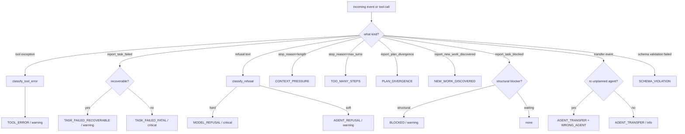

# Drift

A **drift** is a structured observation that execution has diverged
from the plan. goldfive treats drift as first-class: it has a
taxonomy, a severity, a classification function, and a refine policy
that decides whether to replan.

This document enumerates every drift kind, covers classification
rules, and explains when `planner.refine(...)` runs.

Related: [ARCHITECTURE.md](ARCHITECTURE.md#control-direction),
[STATE-MACHINE.md](STATE-MACHINE.md), [PROTOCOLS.md](PROTOCOLS.md#steerer),
[VOCABULARY.md §5 — DriftKind taxonomy](VOCABULARY.md#5-driftkind-taxonomy)
(the authoritative per-kind reference; this doc covers classification
logic and severity bands),
[RATIONALE.md §"Why drift severity is a 3-level enum"](RATIONALE.md#why-drift-severity-is-a-3-level-enum-infowarningcritical-not-a-number).

## The `DriftEvent` shape

```python
# pseudo-code: reproduces the live ``DriftEvent`` dataclass in
# ``goldfive/types.py`` for reference.
@dataclasses.dataclass
class DriftEvent:
    kind: DriftKind          # one of 25+ enum values
    severity: DriftSeverity  # info | warning | critical
    detail: str = ""
    current_task_id: str = ""
    current_agent_id: str = ""
    raw: Any = None          # original trigger (event, exception, tool call)
```

`kind` and `severity` together determine whether refine runs. `detail`
is the human-readable one-liner that flows through to the UI / logs /
planner prompt. `current_task_id` and `current_agent_id` are filled in
from `session` at emission time. `raw` is the trigger — a tool error,
an adapter-streamed block, a reporting-tool call — preserved for
post-hoc analysis.

## Severity levels

Three severities, as a `StrEnum`:

| Severity | Meaning | Refine behavior |
|---|---|---|
| `info` | Noise-level — visible in the event stream, does not trigger refine. | no refine |
| `warning` | The plan should adapt; refine runs. | refine triggered |
| `critical` | Either refine urgently, or the run cannot recover. | refine triggered; may surface as `RunAborted` |

The default refine policy is simple: **any drift of severity
`warning` or above triggers `planner.refine(...)`**. Customizing the
threshold is a matter of subclassing `DefaultSteerer` and overriding
`should_refine(drift) -> bool`.

## The taxonomy

All kinds live in the `DriftKind` `StrEnum`. Mirrors harmonograf where
analogous (goldfive owns the canonical list from v0.1 forward). The
kinds group naturally into six categories.

### Error category — the agent or a tool failed

| Kind | Trigger | Default severity | Recoverable |
|---|---|---|---|
| `TOOL_ERROR` | Adapter observed a tool raising an exception or returning an error payload. | `warning` | yes |
| `AGENT_REFUSAL` | LLM refused to proceed with polite language ("I can't help with that"). | `warning` | yes |
| `MODEL_REFUSAL` | Hard refusal — safety-filter style. | `critical` | no |
| `SAFETY_CONCERN` | Detected content policy / safety trigger from the model. | `critical` | no |
| `TASK_FAILED_RECOVERABLE` | `report_task_failed(task_id, reason, recoverable=True)` | `warning` | yes |
| `TASK_FAILED_FATAL` | `report_task_failed(task_id, reason, recoverable=False)` | `critical` | no |
| `REPEATED_FAILURE` | Same task has now failed `>= N` times in one run. | `critical` | sometimes |
| `TASK_TIMEOUT` | Task exceeded its predicted duration by a wide factor. | `warning` | yes |

### Divergence category — work no longer matches the plan

| Kind | Trigger | Default severity | Recoverable |
|---|---|---|---|
| `PLAN_DIVERGENCE` | `report_plan_divergence(note, suggested_action)` | `warning` | yes |
| `STOPPED_EARLY` | Agent stopped emitting before marking the task terminal. | `warning` | yes |
| `TOO_MANY_STEPS` | Adapter observed an unreasonable step count in a single invocation. | `warning` | yes |
| `UNEXPECTED_OUTPUT` | Output did not match a caller-supplied schema / heuristic. | `warning` | yes |
| `SCHEMA_VIOLATION` | Structured output failed validation. | `warning` | yes |
| `HALLUCINATION_SUSPECTED` | Output references entities the session never produced. | `warning` | yes |

### Structural category — the agent or the plan is shaped wrong

| Kind | Trigger | Default severity | Recoverable |
|---|---|---|---|
| `WRONG_AGENT` | Reporting tool call came from an agent that is not `task.assignee_agent_id`. | `warning` | yes |
| `AGENT_TRANSFER` | Adapter observed a transfer / delegation to an unplanned agent. | `info` | yes |
| `CONTEXT_PRESSURE` | Adapter observed a `finish_reason` indicating the context window was hit. | `warning` | yes |
| `RESOURCE_EXHAUSTED` | Adapter observed rate-limit or quota exhaustion. | `warning` | yes |
| `BLOCKED` | `report_task_blocked(task_id, blocker)` with a structural blocker. | `warning` | sometimes |

### Discovery category — new work that was not in the plan

| Kind | Trigger | Default severity | Recoverable |
|---|---|---|---|
| `NEW_WORK_DISCOVERED` | `report_new_work_discovered(parent_task_id, title, description, assignee)` | `warning` | yes |

### User category — external control signal

| Kind | Trigger | Default severity | Recoverable |
|---|---|---|---|
| `USER_STEER` | Caller synthesized a `DriftEvent` to redirect the run. | `warning` | yes |
| `USER_CANCEL` | Caller cancelled the run. | `critical` | no |

### Goal category — we will not be able to finish

| Kind | Trigger | Default severity | Recoverable |
|---|---|---|---|
| `GOAL_UNREACHABLE` | Planner returned `None` from refine; no further progress possible. | `critical` | no |
| `AMBIGUOUS_INTENT` | Multiple plausible goal interpretations; needs clarification. | `warning` | yes |

### Escape hatch

| Kind | Trigger | Default severity |
|---|---|---|
| `CUSTOM` | Caller-supplied drift kind not covered by the enum. Detail carries the real kind as a free-form string. | caller chooses |

`CUSTOM` exists to let external sinks or callers feed domain-specific
drift signals without forcing a proto change. Prefer a named kind
when one fits.

## Classification

`DefaultSteerer.detect_drift(event, session) -> DriftEvent | None`
runs after every `adapter.invoke()` completes and during streamed
adapter events (when the adapter supports streaming). It is a pure
function of the event plus session state.

The classification dispatch table:



The helper classifiers live in `goldfive/drift.py`:

```python
# pseudo-code: signature-only view. Live definitions are in
# ``goldfive/drift.py``.
def classify_tool_error(event: Any) -> DriftEvent | None: ...
def classify_refusal(text: Any) -> DriftEvent | None: ...
def classify_stop_reason(reason: Any) -> DriftEvent | None: ...
```

Each helper takes an opaque event/text/reason (harmonograf-ish dicts,
plain strings, or framework-native objects) and returns a
``DriftEvent`` when a signal is recognised or ``None`` otherwise.
Subclasses of `DefaultSteerer` can override any of them to tune
thresholds or add domain-specific signals (for example a
schema-violation classifier of your own).

## Refine policy

When `Steerer.detect_drift()` returns a `DriftEvent`, the executor
decides whether to act on it:

```python
# pseudo-code: `emit_drift_detected` / `emit_run_aborted` /
# `emit_plan_revised` / `drift_is_recoverable` are illustrative
# executor-local helpers. The real call sites live inline in
# ``goldfive/executors/sequential.py`` and
# ``goldfive/executors/parallel.py``.
drift = steerer.detect_drift(result, session)
if drift is None:
    continue
await emit_drift_detected(sinks, drift, session)

if drift.severity == DriftSeverity.INFO:
    continue  # informational; proceed

if not drift_is_recoverable(drift):
    await emit_run_aborted(sinks, reason=f"unrecoverable: {drift.kind}", drift=drift)
    return ExecutionOutcome(success=False, session=session, reason=str(drift.kind))

revised = await planner.refine(plan=session.plan, drift=drift, goals=session.goals)
if revised is None:
    # planner declined to revise — treat as goal-unreachable
    await emit_run_aborted(sinks, reason="planner declined refine", drift=drift)
    return ExecutionOutcome(success=False, session=session, reason="goal_unreachable")

session.plan = revised
await emit_plan_revised(sinks, plan=revised, drift=drift, session=session)
```

Three invariants govern the refine path:

1. **Completed tasks are preserved.** `planner.refine()` implementations
   must not return a plan that deletes or re-runs completed tasks.
2. **Revision metadata is stamped.** The revised plan's
   `revision_reason`, `revision_kind`, `revision_severity`, and
   `revision_index` fields are set by the executor before emission.
3. **Refine is throttled.** Multiple drifts of the same kind within
   `DEFAULT_REFINE_THROTTLE_SECONDS` (2s) collapse into one refine
   call. `critical` drifts bypass the throttle.

## How drifts become events

Every `DriftEvent` produces exactly one `DriftDetected` event in the
proto stream. The event envelope carries:

- `kind` — the `DriftKind` string value.
- `severity` — the `DriftSeverity` string value.
- `detail` — human-readable note.
- `current_task_id`, `current_agent_id` — from the session at
  emission time.
- `recoverable` — derived from severity and kind.
- `raw_summary` — a short stringification of `raw` (the full
  untouched trigger is not serialized into the proto to avoid
  bloating the wire; sinks that need the raw trigger should snapshot
  it in-process).

If refine runs and succeeds, the next event in the stream is
`PlanRevised`, whose `revision_kind` / `revision_severity` / `revision_index`
fields echo the drift. Callers reconstructing state from a JSONL
recovery file can pair `DriftDetected` with the following `PlanRevised`
unambiguously by sequence order.

## Extending the taxonomy

To add a new drift kind:

1. Add a value to the `DriftKind` enum in `goldfive/types.py`.
2. Mirror the value in `proto/goldfive/v1/types.proto` and regenerate.
3. Add a row to the taxonomy table above.
4. Add a classifier helper in `goldfive/drift.py` if the detection
   logic is non-trivial.
5. Wire the classifier into `DefaultSteerer.detect_drift()` (or a
   subclass's override).
6. Update the harmonograf sink front-end metadata so the UI renders it
   with the correct icon / color / label.

See [PROTOCOLS.md](PROTOCOLS.md#steerer) for the full Steerer contract
and [writing-an-agent-adapter.md](../guides/writing-an-agent-adapter.md)
for how adapters surface drift-triggering events.
