# Task state machine

Every task in a goldfive plan moves through a strict state machine. The
machine is **monotonic**: once a task reaches a terminal state, it
cannot leave. It is **owned by the Steerer**: every transition runs
through `Steerer.transition(task_id, to, *, session)` and emits an
event to every sink.

Related: [DRIFT.md](DRIFT.md), [PROTOCOLS.md](PROTOCOLS.md#steerer),
[EVENT-MODEL.md](EVENT-MODEL.md).

## States

```python
# pseudo-code: reproduces the live ``TaskStatus`` ``StrEnum`` in
# ``goldfive/types.py`` for reference.
class TaskStatus(StrEnum):
    PENDING = "PENDING"
    RUNNING = "RUNNING"
    COMPLETED = "COMPLETED"
    FAILED = "FAILED"
    CANCELLED = "CANCELLED"
    BLOCKED = "BLOCKED"
```

| State | Meaning |
|---|---|
| `PENDING` | The task exists in the plan and has not been started. Default state when a plan is first submitted. |
| `RUNNING` | The executor has invoked the adapter for this task. The agent is working. |
| `COMPLETED` | Terminal success. `report_task_completed(...)` was called; the task's output summary is in `session.completed_results[task_id]`. |
| `FAILED` | Terminal failure. `report_task_failed(...)` was called, or the adapter returned an exception, or the executor aborted the task. |
| `CANCELLED` | Terminal. Executor-driven; e.g. after an unrecoverable upstream failure cascaded down to this task. |
| `BLOCKED` | Non-terminal. An external condition prevents progress; the task may return to `RUNNING` once the blocker resolves. |

## The diagram

```mermaid
stateDiagram-v2
    [*] --> PENDING : task added to plan

    PENDING --> RUNNING : executor invokes adapter\n(emits TaskStarted)
    PENDING --> CANCELLED : upstream cancellation cascade\n(emits TaskCancelled)

    RUNNING --> RUNNING : report_task_progress\n(emits TaskProgress; no transition)
    RUNNING --> COMPLETED : report_task_completed\n(emits TaskCompleted)
    RUNNING --> FAILED : report_task_failed or adapter error\n(emits TaskFailed)
    RUNNING --> BLOCKED : report_task_blocked (structural)\n(emits TaskBlocked)
    RUNNING --> CANCELLED : executor cancel\n(emits TaskCancelled)

    BLOCKED --> RUNNING : blocker resolved by refine\n(emits TaskStarted with resume=true)
    BLOCKED --> CANCELLED : refine decides not to resume\n(emits TaskCancelled)
    BLOCKED --> FAILED : refine converts to failure\n(emits TaskFailed)

    COMPLETED --> [*]
    FAILED --> [*]
    CANCELLED --> [*]
```



## Transition rules

Every transition obeys three invariants.

### Invariant 1 — Terminal states absorb

Once a task is in `COMPLETED`, `FAILED`, or `CANCELLED`, no further
transition is legal. `Steerer.transition()` rejects attempts to leave a
terminal state:

```python
# pseudo-code: illustrative of the absorbing-terminal-state guard.
# The real transition method lives in
# ``goldfive/steerer.py::DefaultSteerer.transition``.
async def transition(self, task_id, to, *, detail="", session):
    task = _find_task(session.plan, task_id)
    if task.status in _TERMINAL_STATES:
        logger.warning(
            "ignoring transition %s → %s (already terminal)",
            task.status, to,
        )
        return
    ...
```

This is the single most load-bearing invariant in goldfive. Every
feature downstream (progress reporting, refine, crash recovery,
harmonograf integration) assumes it.

### Invariant 2 — Reporting tools drive the machine

In v0.1, the canonical path into the state machine is through
**reporting tools** (see [tool-protocol.md](../reference/tool-protocol.md)).
When an agent calls `report_task_started("t3")`, the adapter
intercepts, and the steerer applies `PENDING → RUNNING` for task
`t3`.

There are three non-reporting-tool paths in:

- **Executor-driven transitions.** When the executor first picks up a
  `PENDING` task, it calls `steerer.transition(task_id, RUNNING, ...)`
  directly. An agent that also calls `report_task_started` produces a
  no-op (RUNNING → RUNNING).
- **Adapter-observed failures.** If `adapter.invoke()` raises, the
  executor catches, classifies the error as `TOOL_ERROR` or
  `TASK_FAILED_FATAL`, and calls `steerer.transition(task_id, FAILED, ...)`.
- **Cascade cancellations.** On an unrecoverable drift, the executor
  walks downstream PENDING tasks via `Plan.topological_stages()` and
  transitions each to `CANCELLED`.

### Invariant 3 — Transitions emit exactly one event

Every successful transition in `Steerer.transition()` emits one event:

| Transition | Emitted event |
|---|---|
| `PENDING → RUNNING` | `TaskStarted` |
| `RUNNING → RUNNING` (progress) | `TaskProgress` |
| `RUNNING → COMPLETED` | `TaskCompleted` |
| `RUNNING → FAILED` | `TaskFailed` |
| `RUNNING → BLOCKED` | `TaskBlocked` |
| `RUNNING → CANCELLED` | `TaskCancelled` |
| `PENDING → CANCELLED` | `TaskCancelled` |
| `BLOCKED → RUNNING` | `TaskStarted` (with `detail="resumed"`) |
| `BLOCKED → *` | same as the `RUNNING → *` case |

Rejected transitions (into or out of terminal states) emit no events,
just a warning log.

## Blocked vs non-blocked resume

`BLOCKED` is the only non-terminal-non-default state. It exists because
agents sometimes encounter waits that are not failures: "I need a
human approval", "waiting on another process", "no network".

Two ways out of `BLOCKED`:

1. **Refine-driven resume.** The planner may issue a revised plan that
   resolves the blocker (e.g. by adding an approval task, or rerouting
   around the wait). The executor detects that the blocked task now
   has its dependencies satisfied again and calls
   `steerer.transition(task_id, RUNNING, detail="resumed")`.
2. **Terminal conversion.** If refine decides the blocker cannot be
   resolved, the planner returns a plan that converts the blocked task
   to `FAILED` or `CANCELLED`.

In v0.1, automatic blocker resolution (e.g. polling an external
condition) is not in-box. The planner/caller is expected to handle
resolution logic.

## Progress reporting

`report_task_progress(task_id, fraction, detail)` is **not a
transition**. It:

- Stays in `RUNNING`.
- Writes `session.task_progress[task_id] = fraction`.
- Writes `session.agent_notes[task_id] = detail`.
- Emits `TaskProgress(task_id, fraction, detail)`.

Sinks can use progress events for liveness indicators. goldfive does
not use them internally (not even for drift — stalled tasks are
detected via elapsed time, not via progress gaps).

## Cascade semantics on unrecoverable drift

When a drift carries `recoverable=False`, the executor runs the
**unrecoverable cascade**:

```
1. Mark the current task FAILED (if not already terminal).
2. Mark every RUNNING task FAILED.
3. BFS downstream from each just-FAILED task and mark every
   reachable PENDING task CANCELLED.
4. Clear any adapter-bound task context (ContextVars).
5. Emit RunAborted(reason=drift.kind, drift=drift).
```

This is why `FAILED` and `CANCELLED` must be absorbing: the cascade
relies on being able to call `transition(..., CANCELLED)` on any
downstream task without re-checking its history.

## Implementation notes

The reference implementation is `DefaultSteerer` in
`goldfive/steerer.py`. It ports harmonograf's `_AdkState` to a
framework-agnostic form.

- **State storage.** The canonical state lives on `Task.status` in the
  plan, not in a separate dict. `Session.plan` is the single source of
  truth.
- **Concurrency.** `Steerer.transition()` is async but assumes serial
  invocation per run. The Sequential and Parallel-DAG executors both
  uphold this: in Parallel-DAG, reporting-tool callbacks from
  concurrent workers are serialized through an `asyncio.Lock` on the
  steerer.
- **Atomicity.** The state write and the event emission are both
  `await`ed within `transition()`. If a sink raises, the state has
  already changed; goldfive logs and continues. This means state is
  authoritative, sinks are best-effort.

## Testing the state machine

`tests/test_steerer.py` covers every legal transition plus attempts at
illegal ones (terminal → anything, missing task ids, duplicate
completions). When porting this doc to a newer spec, the tests in
[issue #16](https://github.com/pedapudi/goldfive/issues/16) are the
executable contract.
