# Task state machine

Every task in a goldfive plan moves through a strict state machine. The
machine is **monotonic**: once a task reaches a terminal state, it
cannot leave. It is **owned by the Steerer**: every transition runs
through `Steerer.transition(task_id, to, *, session)` (which dispatches
to the matching `Steerer.tasks.mark_task_*` helper) and emits an event
to every sink.

The post-#410 facade exposes three components as public properties on
`DefaultSteerer`:

* `steerer.tasks` — :class:`~goldfive.task_state_machine.TaskStateMachine`,
  owner of every `mark_task_*` transition + `cascade_cancel_downstream`
  + per-status `_emit_task_*` emission.
* `steerer.plans` — :class:`~goldfive.plan_reviser.PlanReviser`, owner
  of every `install_*` plan-install entry point + `_apply_revision` +
  `_emit_plan_revised` + the refine-attempt observability helpers.
* `steerer.drift` — :class:`~goldfive.drift_observer.DriftObserver`,
  owner of `observe` / `observe_reasoning` / `detect_drift` /
  `handle_drift` / `request_invocation_cancel` + the reflective and
  goal-drift judge orchestration.

Related: [DRIFT.md](DRIFT.md), [PROTOCOLS.md](PROTOCOLS.md#steerer),
[EVENT-MODEL.md](EVENT-MODEL.md),
[VOCABULARY.md §4 — TaskStatus state machine](VOCABULARY.md#4-taskstatus-state-machine)
(enum-value reference, owner-per-transition table, and rationale for
why BLOCKED is a status rather than a drift kind),
[RATIONALE.md §"Why `BLOCKED` is a task status rather than a drift
kind"](RATIONALE.md#why-blocked-is-a-task-status-rather-than-a-drift-kind).

## States

```python
# pseudo-code: reproduces the live ``TaskStatus`` ``StrEnum`` in
# ``goldfive/types.py`` for reference.
class TaskStatus(StrEnum):
    PENDING = "PENDING"
    RUNNING = "RUNNING"
    COMPLETED = "COMPLETED"
    FAILED = "FAILED"
    CANCELLED = "CANCELLED"
    BLOCKED = "BLOCKED"
    NOT_NEEDED = "NOT_NEEDED"
```

| State | Meaning |
|---|---|
| `PENDING` | The task exists in the plan and has not been started. Default state when a plan is first submitted. |
| `RUNNING` | The executor has invoked the adapter for this task. The agent is working. |
| `COMPLETED` | Terminal success. `report_task_completed(...)` was called; the task's output summary is in `session.completed_results[task_id]`. |
| `FAILED` | Terminal failure. `report_task_failed(...)` was called, or the adapter returned an exception, or the executor aborted the task. |
| `CANCELLED` | Terminal. Executor-driven; e.g. after an unrecoverable upstream failure cascaded down to this task. |
| `BLOCKED` | Non-terminal. An external condition prevents progress; the task may return to `RUNNING` once the blocker resolves. |
| `NOT_NEEDED` | Terminal (overlay-model only, goldfive#141/#163). PENDING task the tree never exercised during an overlay invocation; stamped when the passthrough invocation ends. Distinct from `CANCELLED` so sinks render "tree chose not to run" vs "user/system cancelled" differently. |

## The diagram

```mermaid
stateDiagram-v2
    [*] --> PENDING : task added to plan

    PENDING --> RUNNING : executor invokes adapter OR\nreconciler observes RUNNING\n(emits TaskStarted)
    PENDING --> CANCELLED : upstream cancellation cascade\n(emits TaskCancelled)
    PENDING --> NOT_NEEDED : overlay invocation end\n(tree did not exercise)

    RUNNING --> RUNNING : report_task_progress\n(emits TaskProgress; no transition)
    RUNNING --> COMPLETED : report_task_completed OR\nreconciler observes after_agent success\n(emits TaskCompleted)
    RUNNING --> FAILED : report_task_failed, adapter error, OR\nreconciler observes after_agent error\n(emits TaskFailed)
    RUNNING --> BLOCKED : report_task_blocked (structural)\n(emits TaskBlocked)
    RUNNING --> CANCELLED : executor cancel\n(emits TaskCancelled)

    BLOCKED --> RUNNING : blocker resolved by refine\n(emits TaskStarted with resume=true)
    BLOCKED --> CANCELLED : refine decides not to resume\n(emits TaskCancelled)
    BLOCKED --> FAILED : refine converts to failure\n(emits TaskFailed)

    COMPLETED --> [*]
    FAILED --> [*]
    CANCELLED --> [*]
    NOT_NEEDED --> [*]
```



## Transition rules

Every transition obeys three invariants.

### Invariant 1 — Terminal states absorb

Once a task is in `COMPLETED`, `FAILED`, `CANCELLED`, or `NOT_NEEDED`,
no further transition is legal. `Steerer.transition()` rejects
attempts to leave a terminal state. `TERMINAL_TASK_STATUSES` in
`goldfive/types.py` is the authoritative set, imported by every
module that gates on terminality.

```python
# pseudo-code: illustrative of the absorbing-terminal-state guard.
# The real transition method lives in
# ``goldfive/steerer.py::DefaultSteerer.transition``.
async def transition(self, task_id, to, *, detail="", session):
    task = _find_task(session.plan, task_id)
    if task.status in _TERMINAL_STATES:
        logger.warning(
            "ignoring transition %s → %s (already terminal)",
            task.status, to,
        )
        return
    ...
```

This is the single most load-bearing invariant in goldfive. Every
feature downstream (progress reporting, refine, crash recovery,
harmonograf integration) assumes it.

### Invariant 2 — Transitions have two canonical entry points

Under the **overlay model (default)**, the primary driver is the
`PlanReconciler` (`goldfive/reconciler.py`). The ADK plugin's
`before_agent_callback` / `after_agent_callback` pairs are forwarded
to `PlanReconciler.on_before_agent` / `.on_after_agent`, which claim
the first PENDING task assigned to the observed agent name (direct
match, or contextual match via the invocation-parent chain,
goldfive#151/#160) and drive `steerer.transition(..., RUNNING)` then
`steerer.transition(..., COMPLETED | FAILED)`.

Under both overlay and legacy modes, agents may also call
**reporting tools** (`report_task_started`, `report_task_completed`,
etc.) to report state directly. The adapter routes those calls
through `goldfive.adapters._tool_invocation.invoke_tool` (which runs
the schema / terminal / loop / volume guards), the spec's handler
fires, and the steerer applies the transition. This is redundant
with the reconciler's observation but harmless — the steerer's
terminal-absorption guard drops duplicate transitions.

Non-reconciler, non-reporting-tool paths in:

- **Executor-driven transitions.** When the executor first picks up a
  `PENDING` task, it calls `steerer.transition(task_id, RUNNING, ...)`
  directly. An agent that also calls `report_task_started` produces a
  no-op (RUNNING → RUNNING).
- **Adapter-observed failures.** If `adapter.invoke()` raises, the
  executor catches, classifies the error as `TOOL_ERROR` or
  `TASK_FAILED_FATAL`, and calls `steerer.transition(task_id, FAILED, ...)`.
- **Cascade cancellations.** `Steerer.cascade_cancel_downstream(session, id)`
  BFS-walks forward along `plan.edges` from a cancelled or fatally-failed
  task and transitions every reachable non-terminal task to `CANCELLED`.
  Used by both the unrecoverable-failure cascade
  (`mark_task_failed(recoverable=False)`) and the cancellation
  cascade on `mark_task_cancelled`. See §"Cascade semantics" below.
- **Reachability audit on executor exit.** If the executor loop
  exits with PENDING tasks still remaining and `_pick_next_task`
  returns `None` (orphans whose every predecessor path crosses a
  terminal task), the executor cancels them in place and emits a
  CRITICAL `PLAN_DIVERGENCE` drift. See
  [PLAN-LIFECYCLE.md §6.4](PLAN-LIFECYCLE.md).

### Invariant 3 — Transitions emit exactly one event

Every successful transition in `Steerer.transition()` emits one event:

| Transition | Emitted event |
|---|---|
| `PENDING → RUNNING` | `TaskStarted` |
| `RUNNING → RUNNING` (progress) | `TaskProgress` |
| `RUNNING → COMPLETED` | `TaskCompleted` |
| `RUNNING → FAILED` | `TaskFailed` |
| `RUNNING → BLOCKED` | `TaskBlocked` |
| `RUNNING → CANCELLED` | `TaskCancelled` |
| `PENDING → CANCELLED` | `TaskCancelled` |
| `PENDING → NOT_NEEDED` | `TaskCancelled` (overlay-only; reason `"not needed (tree did not exercise)"`; task status in the plan is `NOT_NEEDED`) |
| `BLOCKED → RUNNING` | `TaskStarted` (with `detail="resumed"`) |
| `BLOCKED → *` | same as the `RUNNING → *` case |

Rejected transitions (into or out of terminal states) emit no events,
just a warning log.

## Blocked vs non-blocked resume

`BLOCKED` is the only non-terminal-non-default state. It exists because
agents sometimes encounter waits that are not failures: "I need a
human approval", "waiting on another process", "no network".

Two ways out of `BLOCKED`:

1. **Refine-driven resume.** The planner may issue a revised plan that
   resolves the blocker (e.g. by adding an approval task, or rerouting
   around the wait). The executor detects that the blocked task now
   has its dependencies satisfied again and calls
   `steerer.transition(task_id, RUNNING, detail="resumed")`.
2. **Terminal conversion.** If refine decides the blocker cannot be
   resolved, the planner returns a plan that converts the blocked task
   to `FAILED` or `CANCELLED`.

In v0.1, automatic blocker resolution (e.g. polling an external
condition) is not in-box. The planner/caller is expected to handle
resolution logic.

## Progress reporting

`report_task_progress(task_id, fraction, detail)` is **not a
transition**. It:

- Stays in `RUNNING`.
- Writes `session.task_progress[task_id] = fraction`.
- Writes `session.agent_notes[task_id] = detail`.
- Emits `TaskProgress(task_id, fraction, detail)`.

Sinks can use progress events for liveness indicators. goldfive does
not use them internally (not even for drift — stalled tasks are
detected via elapsed time, not via progress gaps).

## Cascade semantics on unrecoverable drift

When a drift carries `recoverable=False`, the **unrecoverable
cascade** runs:

```
1. Mark the current task FAILED (if not already terminal).
2. Mark every RUNNING task FAILED.
3. BFS downstream from each just-FAILED task and mark every
   reachable non-terminal task CANCELLED.
4. Clear any adapter-bound task context (ContextVars).
5. Emit RunAborted(reason=drift.kind, drift=drift).
```

This is why `FAILED` and `CANCELLED` must be absorbing: the cascade
relies on being able to call `transition(..., CANCELLED)` on any
downstream task without re-checking its history.

### Cascade on task cancellation

The same cascade rule applies when **any single task** is
transitioned to `CANCELLED` — not only as part of the unrecoverable
FAILED cascade above. `TaskStateMachine.mark_task_cancelled`
(reachable as `steerer.tasks.mark_task_cancelled`) BFS-walks forward
from the cancelled task through `Plan.edges` and transitions every
reachable non-terminal task (PENDING / RUNNING / BLOCKED) to
`CANCELLED` with reason `"cascade from <task_id>"`. This closes the
soundness gap where a `USER_STEER` whose refine produces no new plan
would cancel the current task but leave downstream PENDING tasks
silently orphaned (they never satisfy `_pick_next_task`'s "all
predecessors COMPLETED" check). See
[TASK-LIFECYCLE.md §6.1 — Cancellation cascade](TASK-LIFECYCLE.md#61-cancellation-cascade).

### Shared downstream-CANCEL primitive

Both cascades (the unrecoverable case above and the cancel-cascade
below) fan out to downstream tasks through **one shared primitive**:
`Steerer.cascade_cancel_downstream(session, cancelled_id)` declared
on `goldfive/protocols.py` and implemented on
`TaskStateMachine.cascade_cancel_downstream` in
`goldfive/task_state_machine.py` (callers reach it as
`steerer.tasks.cascade_cancel_downstream`). The primitive:

- walks `session.plan.edges` forward from the initiator,
- transitions every reachable non-terminal task to `CANCELLED`,
- emits exactly one `TaskCancelled` event per transition with
  reason `"cascade from <cancelled_id>"`,
- skips already-terminal tasks (diamond-DAG-safe).

Having a single primitive means the §6.2 and §6.3 downstream event
streams are identical — sinks (and harmonograf's UI) see the same
shape regardless of whether the cascade was seeded by a CANCEL or a
fatal FAILED. The "mark every RUNNING task FAILED" step of the
unrecoverable cascade is *not* part of this primitive; that stays
separate because the unrecoverable path explicitly wants `FAILED`
status (not `CANCELLED`) on running work that the fatal drift
invalidated.

## Implementation notes

The reference implementation is `DefaultSteerer` in
`goldfive/steerer.py`, a thin router that exposes three components as
public properties:

* `goldfive/task_state_machine.py::TaskStateMachine` — task transitions
  + cascade + per-status event emission (`steerer.tasks`).
* `goldfive/plan_reviser.py::PlanReviser` — plan-install, refine
  attempt observability, and revision application (`steerer.plans`).
* `goldfive/drift_observer.py::DriftObserver` — drift detection,
  intervention ladder, judge orchestration, and refine-outcome
  bookkeeping (`steerer.drift`).

Together they port harmonograf's `_AdkState` to a framework-agnostic
form.

- **State storage.** The canonical state lives on `Task.status` in the
  plan, not in a separate dict. `Session.plan` is the single source of
  truth.
- **Concurrency.** `Steerer.transition()` is async but assumes serial
  invocation per run. The Sequential and Parallel-DAG executors both
  uphold this: in Parallel-DAG, reporting-tool callbacks from
  concurrent workers are serialized through an `asyncio.Lock` on the
  steerer.
- **Atomicity.** The state write and the event emission are both
  `await`ed within `transition()`. If a sink raises, the state has
  already changed; goldfive logs and continues. This means state is
  authoritative, sinks are best-effort.

## Testing the state machine

`tests/test_steerer.py` covers every legal transition plus attempts at
illegal ones (terminal → anything, missing task ids, duplicate
completions). When porting this doc to a newer spec, the tests in
[issue #16](https://github.com/pedapudi/goldfive/issues/16) are the
executable contract.
