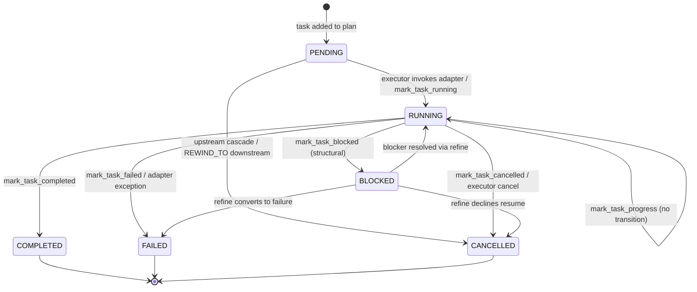

# Vocabulary

goldfive's surface looks small — six protocols, four enums, a handful of
dataclasses — but each name carries a specific, load-bearing meaning
that is easy to confuse with a neighbour. This document is the exhaustive
type-system reference. Every enum value, every dataclass field, every
protocol method that plays a semantic role is enumerated here with its
purpose, its emitter/consumer, and its bridges to other types.

If you have ever asked any of these questions, this doc is for you:

- "What's the difference between `ControlKind.STEER` and
  `DriftKind.USER_STEER`?"
- "Is `BLOCKED` a task status or a drift kind? Both?"
- "Who fires `PlanRevised` — the Runner, the Executor, or the Steerer?"
- "Why does `DriftSeverity.WARNING` trigger refine but `INFO` doesn't?"

Related:

- [ARCHITECTURE.md](ARCHITECTURE.md) — the six primitives, top-level
  lifecycle.
- [PROTOCOLS.md](PROTOCOLS.md) — the protocol contracts in detail.
- [STATE-MACHINE.md](STATE-MACHINE.md) — the task lifecycle diagram.
- [DRIFT.md](DRIFT.md) — the drift taxonomy and classifier rules.
- [EVENT-MODEL.md](EVENT-MODEL.md) — the proto event envelope.
- [RATIONALE.md](RATIONALE.md) — design-rationale "why" document.

> All enums in this doc are `StrEnum` and live in `goldfive/types.py`
> (`TaskStatus`, `DriftKind`, `DriftSeverity`) or `goldfive/control.py`
> (`ControlKind`, `AckResult`). Values match the string literal spellings
> shown below.

## 1. The four semantic enums

goldfive has four enums that classify run state. They do not overlap,
but they do *bridge* to one another — a `ControlKind` can become a
`DriftKind`, a `DriftKind` can induce a `TaskStatus` transition. This
section tabulates all four side-by-side so the shapes sit next to each
other.

| Enum | Module | Purpose | Emitted by | Consumed by |
|---|---|---|---|---|
| `ControlKind` | `goldfive/control.py` | Verbs an **external controller** (UI, CLI, tests) can issue to a running `Runner`. | External bridge (e.g. `harmonograf_client.observe`, a CLI, a test harness) via `ControlChannel.send(ControlMessage)`. | Executors drain via `ControlChannel.receive()` and dispatch in `goldfive/executors/_control.py::dispatch_control`. |
| `DriftKind` | `goldfive/types.py` | Taxonomy of **observations that execution has diverged from the plan**. A classification, not a verb. | Steerer (via `classify_*` helpers, reporting-tool handlers, and explicit synthesis on USER_* bridges). Also by executors surfacing task failures. | `DefaultSteerer._handle_drift` decides whether to trigger `planner.refine` based on `DriftKind` + `DriftSeverity`. Sinks receive `DriftDetected` events. |
| `DriftSeverity` | `goldfive/types.py` | Ordinal urgency of a drift: `INFO`, `WARNING`, `CRITICAL`. | Attached to every `DriftEvent` by whoever synthesizes it. | `DefaultSteerer._handle_drift` gates refine on `severity >= WARNING`; executors may abort on `CRITICAL`. |
| `TaskStatus` | `goldfive/types.py` | The per-task state machine: `PENDING`, `RUNNING`, `COMPLETED`, `FAILED`, `CANCELLED`, `BLOCKED`. | Transitions owned by `DefaultSteerer.mark_task_*` methods (called from reporting tools, adapters, or the executor). | Every layer reads `Task.status`; executors filter by it to decide what to dispatch; sinks emit `Task*` events on transitions. |

### Why four enums, not three or five?

- `TaskStatus` describes **one task's place in its lifecycle**. It never
  describes user intent or drift severity.
- `DriftKind` describes **the category of a divergence**. It is
  informational — knowing the kind does not yet dictate an action.
- `DriftSeverity` is **the orthogonal axis** that turns a kind into a
  policy decision (refine vs ignore vs abort).
- `ControlKind` describes **external verbs**. It is the *only* enum
  whose values are not derived from observing execution — they are
  injected from outside.

The symmetry: a `ControlKind` (external verb) is often *bridged* into a
`DriftKind` (internal observation) before it acts on the plan. The
next section walks one such bridge end-to-end.

## 2. `ControlKind` vs `DriftKind` — a worked example

The subtlest distinction in goldfive is between the five `ControlKind`
values and the three `USER_*` `DriftKind` values that mirror some of
them. This section uses `ControlKind.STEER → DriftKind.USER_STEER` as
the worked example because it has the richest downstream behavior.

### The cast of characters

- `ControlKind.STEER` — a **verb** the UI issues. "Redirect the run."
  It is one of five `ControlKind` values (`PAUSE`, `RESUME`, `CANCEL`,
  `STEER`, `REWIND_TO`). Always carries a payload
  `{"note": "...", "suggested_action": "..."}`.
- `DriftKind.USER_STEER` — an **observation** the Steerer emits. "The
  user has steered the run." It is one of three `USER_*` drift kinds
  (`USER_STEER`, `USER_CANCEL`, `USER_PAUSE`).
- `ControlMessage` — the envelope carrying a `ControlKind` + payload +
  id.
- `ControlChannel` — the bidirectional async queue pair in
  `goldfive/control.py`.
- `DriftEvent` — the in-memory dataclass the Steerer builds; it has
  `kind: DriftKind`, `severity: DriftSeverity`, `detail`,
  `current_task_id`, `raw`.

### Flow: click → refine

```
┌─────────────┐      user clicks "Steer" in harmonograf UI
│   UI / CLI  │
└──────┬──────┘
       │ ControlEvent(kind=STEER, payload={"note": "focus on slide 3"})
       │
┌──────▼──────────────────────────────────────────────────────────┐
│ harmonograf_client.observe bridge (external to goldfive)         │
│  - translates harmonograf ControlEvent → goldfive ControlMessage │
│  - ControlMessage(kind=ControlKind.STEER, payload={...},         │
│                   id="c-7af1...")                                │
└──────┬──────────────────────────────────────────────────────────┘
       │ channel.send(msg)
       │
┌──────▼──────────┐
│ ControlChannel  │  inbox queue (asyncio.Queue[ControlMessage])
└──────┬──────────┘
       │
       │ executor drains: channel.receive() → msg
       │
┌──────▼─────────────────────────────────────────────────────────┐
│ goldfive/executors/_control.py::dispatch_control(msg)          │
│  - kind == "STEER" → ControlOutcome(steer_message=msg,         │
│                                     ack=ACK/SUCCESS)           │
│  - channel.ack(outcome.ack) flows back out to the UI           │
└──────┬─────────────────────────────────────────────────────────┘
       │ outcome.steer_message
       │
┌──────▼─────────────────────────────────────────────────────────┐
│ executor._apply_steer(msg, steerer, session)                   │
│  - calls steerer.observe(msg, session)                         │
└──────┬─────────────────────────────────────────────────────────┘
       │ steerer.observe sees a ControlMessage with STEER →
       │ synthesizes DriftEvent(kind=USER_STEER, severity=WARNING,
       │                        detail="control:STEER:c-7af1...",
       │                        raw=msg)
       │
┌──────▼─────────────────────────────────────────────────────────┐
│ DefaultSteerer._handle_drift(drift, session)                   │
│  - emits DriftDetected event on sinks                          │
│  - severity WARNING ≥ WARNING → calls planner.refine(...)      │
└──────┬─────────────────────────────────────────────────────────┘
       │ planner.refine(plan, drift=DriftEvent(USER_STEER), goals)
       │
┌──────▼─────────────────────────────────────────────────────────┐
│ LLMPlanner.refine (or any custom planner)                      │
│  - For USER_STEER: preserve completed tasks, drop pending      │
│    tasks, generate a fresh plan that honours drift.detail.     │
│  - Returns revised Plan.                                       │
└──────┬─────────────────────────────────────────────────────────┘
       │ session.plan = revised
       │
┌──────▼─────────────────────────────────────────────────────────┐
│ PlanRevised event emitted; revision_kind=USER_STEER,           │
│ revision_severity=WARNING, revision_reason=drift.detail        │
└────────────────────────────────────────────────────────────────┘
```

### What each boundary does

1. **UI → bridge** — a product-level click becomes a transport-level
   message. The bridge is the only component that touches both
   harmonograf's proto schema and goldfive's public API.
2. **Bridge → ControlChannel** — the bridge picks the right
   `ControlKind` from the harmonograf verb and wraps the payload. This
   is the point where `harmonograf.ControlEvent.STEER` *becomes*
   `ControlKind.STEER`.
3. **ControlChannel → dispatch_control** — the executor drains, the
   dispatcher builds a `ControlOutcome`. `STEER` is special: the outcome
   carries the whole `ControlMessage` so the executor can feed it to
   the steerer on the next step.
4. **dispatch → steerer.observe** — this is the **bridge from
   `ControlKind.STEER` to `DriftKind.USER_STEER`**. The Steerer sees a
   ControlMessage; it synthesizes a `DriftEvent` with
   `kind=DriftKind.USER_STEER`. From here on, `STEER` the verb is gone;
   only `USER_STEER` the observation remains.
5. **_handle_drift → planner.refine** — the standard drift pipeline
   takes over. `USER_STEER` is `WARNING` severity, so refine runs.
6. **planner → revised plan** — for `USER_STEER` specifically, the
   planner semantics are "delete-and-replan": completed tasks are
   preserved as context, pending tasks are dropped, a new plan is
   generated that incorporates the steering note.

### Why `ControlKind` and `DriftKind` don't share values

They describe different things:

- `ControlKind` is an **imperative verb from outside**. It has no
  severity, no current task, no detail that is meant for an LLM.
- `DriftKind` is a **categorized observation from inside**. It has
  severity, current-task context, and a detail string meant for the
  planner's refine prompt.

The bridge `USER_STEER`/`USER_CANCEL`/`USER_PAUSE` exists because once
the Steerer has synthesized a `DriftEvent`, the rest of the machinery
is pipeline-shaped: it only knows how to react to drift. Any external
verb that wants to trigger replanning has to enter that pipeline, and
the `USER_*` drift kinds are the canonical entry points.

## 3. All control → drift bridges

Five `ControlKind` values, three `USER_*` `DriftKind` bridges, two
non-bridging outcomes. Here is the mapping:

| `ControlKind` | Bridges to `DriftKind`? | Severity of resulting drift | Triggers `planner.refine`? | Non-drift effect |
|---|---|---|---|---|
| `PAUSE` | `USER_PAUSE` | `INFO` (observational) | No (INFO is below threshold) | Executor sets paused flag; blocks its outer loop on `channel.receive()` until RESUME/CANCEL/STEER arrives. |
| `RESUME` | — (no drift) | — | — | Clears the paused flag in the executor. |
| `CANCEL` | `USER_CANCEL` | `CRITICAL` | No (the executor aborts before refine runs) | Executor raises `_ControlCancelled`; emits `RunAborted` with the cancel reason. |
| `STEER` | `USER_STEER` | `WARNING` | **Yes** — this is the canonical live-replan trigger. | None — the entire effect is via the drift pipeline. |
| `REWIND_TO` | — (no drift; handled inline) | — | No (reset is structural, not a planner decision) | `_rewind_plan` walks downstream from `payload.task_id` and marks every reachable task `PENDING`; the executor's next iteration re-walks them. |

Two notes on this table:

- **`PAUSE` emits `USER_PAUSE` at `INFO` severity.** That means the
  drift is visible in the event stream (sinks see a `DriftDetected`),
  but the default refine policy does not fire. The pause effect comes
  entirely from the executor's blocking-wait behavior on the next
  control poll, not from replanning.
- **`CANCEL` synthesizes `USER_CANCEL` at `CRITICAL` severity, but the
  executor has already decided to abort by the time the drift would
  fire refine.** The `USER_CANCEL` drift is produced in
  `goldfive.events.control_received_event` (used by historical
  harmonograf bridges for audit trails); the executor's `dispatch_control`
  short-circuits the cancel path into a `ControlOutcome(cancel_run=True)`
  without routing through `steerer.observe`. Either path ends in a
  `RunAborted` event.

### Which bridges go through `steerer.observe` today

Only `STEER` is currently wired so that the Steerer synthesizes the
drift. `PAUSE` and `CANCEL` have their corresponding `USER_*` drift
kinds defined so *external* emitters (a bridge, a test, a custom
adapter) can synthesize them and feed them to `steerer.observe` if they
want refine to run. In the in-box Phase 1 executor path, pause is a
blocking wait and cancel is a direct abort.

## 4. `TaskStatus` state machine

Six states, monotonic once terminal. Full transition rules live in
[STATE-MACHINE.md](STATE-MACHINE.md); this section is the canonical
enum reference.

| State | String | Terminal? | Meaning |
|---|---|---|---|
| `PENDING` | `"PENDING"` | no | Task exists in the plan, has not been started. Default on every new task in a fresh plan. |
| `RUNNING` | `"RUNNING"` | no | Executor has dispatched `adapter.invoke(task, session)` OR the `PlanReconciler` observed an agent running for this task. Agent is working. |
| `COMPLETED` | `"COMPLETED"` | **yes** | Terminal success. Output is in `session.completed_results[task_id]`. Reached via `report_task_completed` or reconciler-observed `after_agent`. |
| `FAILED` | `"FAILED"` | **yes** | Terminal failure. Reached via `report_task_failed`, adapter exception, reconciler-observed `after_agent` with error, or executor-driven failure. |
| `CANCELLED` | `"CANCELLED"` | **yes** | Terminal. Reached via executor cancellation cascade or `report_task_cancelled`. |
| `BLOCKED` | `"BLOCKED"` | no | External condition prevents progress. Task can return to `RUNNING` if the planner resolves the blocker, or convert to `FAILED`/`CANCELLED`. |
| `NOT_NEEDED` | `"NOT_NEEDED"` | **yes** | Overlay-only (goldfive#141/#163). PENDING task the tree never exercised during the single passthrough invocation; stamped at invocation end. Distinct from `CANCELLED` so sinks can render "tree chose not to run" vs "user/system cancelled" differently. Proto enum value 7. |

### State diagram



### Who owns each transition

| Transition | Owner | Entry point |
|---|---|---|
| `PENDING → RUNNING` | Steerer | `DefaultSteerer.mark_task_running` (called by executor on task dispatch or by a reporting tool handler) |
| `RUNNING → RUNNING` (progress) | Steerer | `DefaultSteerer.mark_task_progress` (reporting tool) |
| `RUNNING → COMPLETED` | Steerer | `DefaultSteerer.mark_task_completed` (reporting tool) |
| `RUNNING → FAILED` | Steerer | `DefaultSteerer.mark_task_failed` (reporting tool, or executor on adapter exception) |
| `RUNNING → BLOCKED` | Steerer | `DefaultSteerer.mark_task_blocked` (reporting tool) |
| `RUNNING → CANCELLED` | Steerer | `DefaultSteerer.mark_task_cancelled` (executor on cascade or control CANCEL) |
| `PENDING → CANCELLED` | Steerer | `DefaultSteerer.mark_task_cancelled` (executor on cascade) |
| `BLOCKED → RUNNING` | Steerer | `DefaultSteerer.mark_task_running` after planner refinement |

All six transitions share two properties:

1. **They emit exactly one event per successful transition.** The event
   kinds are listed in the table below.
2. **They are idempotent on terminal states.** Attempting to transition
   out of `COMPLETED`/`FAILED`/`CANCELLED` is a silent no-op.

### Transition → event table

| Transition | Emitted event |
|---|---|
| `PENDING → RUNNING` | `TaskStarted` |
| `RUNNING → RUNNING` (progress ping) | `TaskProgress` |
| `RUNNING → COMPLETED` | `TaskCompleted` |
| `RUNNING → FAILED` | `TaskFailed` |
| `RUNNING → BLOCKED` | `TaskBlocked` |
| `* → CANCELLED` | `TaskCancelled` |

### Why `BLOCKED` is a status, not just a drift kind

There is both `TaskStatus.BLOCKED` and `DriftKind.BLOCKED`. They are
not duplicates — they are two ends of one semantic.

- `TaskStatus.BLOCKED` says "this task is waiting on something external
  and cannot make forward progress right now." It is a **position in
  the lifecycle** — the task is still alive and may resume. It does not
  imply any replanning intent.
- `DriftKind.BLOCKED` says "we have observed that a task became
  blocked, and the plan may need to adapt." It is an **observation
  about that transition** and flows through the refine pipeline.

When a reporting tool calls `report_task_blocked(t, blocker, needed)`,
`DefaultSteerer.mark_task_blocked` does *both* things: it transitions
the task to `TaskStatus.BLOCKED` (emitting `TaskBlocked`) *and*
synthesizes a `DriftEvent(kind=DriftKind.BLOCKED, severity=WARNING)`
which flows into `_handle_drift`. Refine may then revise the plan to
route around the blocker. If refine declines (returns `None`), the
blocked task sits in `BLOCKED` until something else — another refine,
a `REWIND_TO` control, or a cascade cancel — moves it.

Contrast this with, say, `CONTEXT_PRESSURE` drift: there is no
corresponding `TaskStatus.CONTEXT_PRESSED`. Why? Because context
pressure is **about a single invocation**, not about the task as a
whole. The task is still `RUNNING`; what the drift tells us is "that
run truncated, consider a refine that splits the task smaller or
re-orders context." The status axis and the drift axis are orthogonal
and should stay that way.

See [RATIONALE.md §"Why `BLOCKED` is a task status rather than a drift
kind"](RATIONALE.md#why-blocked-is-a-task-status-rather-than-a-drift-kind)
for the long-form rationale.

## 5. `DriftKind` taxonomy

26 values total (25 named kinds + `CUSTOM`). Every value is defined in
`goldfive/types.py::DriftKind`; enum values are the lower-snake-case
strings on the right of the `=` in that file. Grouped here by what
*triggers* them.

### 5.a Model-driven — the LLM itself signalled something

Kinds synthesized from signals coming out of the model or adapter layer.

| `DriftKind` | Value | Default severity | Trigger |
|---|---|---|---|
| `TOOL_ERROR` | `"tool_error"` | `WARNING` | `classify_tool_error(event)` matched a tool-result shape with a truthy error / `status=FAILED`/`ok=False`. |
| `AGENT_REFUSAL` | `"agent_refusal"` | tier-graded (`INFO` / `WARNING` / `CRITICAL`) | `classify_refusal(text)` matched a marker in one of `LLM_REFUSAL_MARKERS_CRITICAL` (policy/safety, e.g. "I must decline"), `LLM_REFUSAL_MARKERS_WARNING` (capability, e.g. "I cannot"), or `LLM_REFUSAL_MARKERS_INFO` (hedging, e.g. "I'm not confident"). Scan order is CRITICAL -> WARNING -> INFO, first match wins. |
| `MODEL_REFUSAL` | `"model_refusal"` | `CRITICAL` | Adapter-specific hard refusal path (safety-filter style). Not classified by default; adapters synthesize directly. |
| `HALLUCINATION_SUSPECTED` | `"hallucination_suspected"` | `WARNING` | Output references entities the session never produced. Caller-supplied heuristic; no default classifier. |
| `STOPPED_EARLY` | `"stopped_early"` | `WARNING` | Agent emitted nothing before exiting its turn. Adapter-detected. |
| `UNEXPECTED_OUTPUT` | `"unexpected_output"` | `WARNING` | Output failed a caller-supplied schema / heuristic. |
| `SCHEMA_VIOLATION` | `"schema_violation"` | `WARNING` | Structured-output validation failed. |
| `SAFETY_CONCERN` | `"safety_concern"` | `CRITICAL` | Safety-filter trigger observed by the adapter. |

### 5.b Plan-driven — the plan is wrong or incomplete

Kinds that mean "the plan, as written, is not the right plan for this
run."

| `DriftKind` | Value | Default severity | Trigger |
|---|---|---|---|
| `PLAN_DIVERGENCE` | `"plan_divergence"` | `WARNING` | Reporting tool `report_plan_divergence(note, suggested_action)` called. Flags `session.divergence_flag`. |
| `NEW_WORK_DISCOVERED` | `"new_work_discovered"` | `WARNING` | Reporting tool `report_new_work_discovered(parent_task_id, title, description, assignee)` called. |
| `GOAL_UNREACHABLE` | `"goal_unreachable"` | `CRITICAL` | Planner returned `None` from `refine`; the plan cannot be revised to reach the goal. |
| `AMBIGUOUS_INTENT` | `"ambiguous_intent"` | `WARNING` | Multiple plausible goal interpretations; needs user clarification. Typically synthesized at plan-generation time. |
| `REFINE_VALIDATION_FAILED` | `"refine_validation_failed"` | `CRITICAL` | `LLMPlanner` exhausted its refine retry budget — the LLM response could not be parsed or pass `Plan.validate(for_revision=True, prior=...)`. Emitted via the planner's drift-emitter callback (wired by `DefaultSteerer.bind`). The steerer deliberately does NOT trigger another `planner.refine` on this kind (infinite-loop risk). See goldfive#133. |

### 5.c Runtime — the environment limited progress

Kinds that mean "progress stalled or failed due to limits on the runtime
rather than a reasoning error."

| `DriftKind` | Value | Default severity | Trigger |
|---|---|---|---|
| `CONTEXT_PRESSURE` | `"context_pressure"` | `WARNING` | `classify_stop_reason` matched a `CONTEXT_PRESSURE_STOP_REASONS` value (`MAX_TOKENS`, `LENGTH`, `TRUNCATED`, `CONTENT_FILTER`, `MAX_OUTPUT_TOKENS`). |
| `TOO_MANY_STEPS` | `"too_many_steps"` | `WARNING` | Adapter observed an unreasonable step count in a single invocation. Adapter-synthesized. |
| `TASK_TIMEOUT` | `"task_timeout"` | `WARNING` (escalating `CRITICAL`) | Wall-clock stall watchdog (`SteeringConfig.stall_watchdog_enabled`, default OFF): session liveness watermark silent for `stall_timeout_s`; CRITICAL on continued silence. |
| `REPEATED_FAILURE` | `"repeated_failure"` | `CRITICAL` | Same task has now failed `>= N` times in one run. |
| `RESOURCE_EXHAUSTED` | `"resource_exhausted"` | `WARNING` | Rate-limit or quota exhaustion observed by the adapter. |
| `TASK_FAILED_RECOVERABLE` | `"task_failed_recoverable"` | `WARNING` | `mark_task_failed(..., recoverable=True)` (default). |
| `TASK_FAILED_FATAL` | `"task_failed_fatal"` | `CRITICAL` | `mark_task_failed(..., recoverable=False)`. |
| `BLOCKED` | `"blocked"` | `WARNING` | `mark_task_blocked(task_id, blocker, needed)` — both a `TaskBlocked` event and a drift. |

### 5.d User-driven — an external verb entered the pipeline

Kinds that mirror `ControlKind` verbs after the bridge. See §3 above for
the full bridge table.

| `DriftKind` | Value | Default severity | Bridges from |
|---|---|---|---|
| `USER_STEER` | `"user_steer"` | `WARNING` | `ControlKind.STEER` (via `steerer.observe(ControlMessage)`). Idempotent by `annotation_id` or `ControlMessage.id` (goldfive#171); emitted `DriftDetected` carries `annotation_id` (field 6) so sinks can dedup against the source annotation row. |
| `USER_CANCEL` | `"user_cancel"` | `CRITICAL` | `ControlKind.CANCEL` (synthesized in `control_received_event` for audit; executor short-circuits to `RunAborted`). Emitted `DriftDetected` carries `annotation_id` when the bridge sourced one. |
| `USER_PAUSE` | `"user_pause"` | `INFO` | `ControlKind.PAUSE` (synthesized for audit; executor blocks on next poll). |

### 5.e Transfer — the wrong agent picked something up

Kinds about who is doing the work.

| `DriftKind` | Value | Default severity | Trigger |
|---|---|---|---|
| `WRONG_AGENT` | `"wrong_agent"` | `WARNING` | A reporting tool call arrived from an agent that is not `task.assignee_agent_id`. Typically paired with `AGENT_TRANSFER`. |
| `AGENT_TRANSFER` | `"agent_transfer"` | `INFO` when planned; `WARNING` when unplanned | Adapter observed a transfer/delegation event. |
| `INTERCEPT_TRANSFER` | — (not an enum value; handled via `session._intercept_transfer` flag in `_control.py`) | — | `ControlKind.INTERCEPT_TRANSFER` message toggles the flag; adapters that honour it refuse subsequent transfers. |

`INTERCEPT_TRANSFER` is listed here for completeness even though it is
not currently in the `DriftKind` enum. It is recognized as a control
kind-by-string (see `_control.py::dispatch_control`) and its effect is
session-state mutation, not drift synthesis.

### 5.f Escape hatch

| `DriftKind` | Value | Default severity | Trigger |
|---|---|---|---|
| `CUSTOM` | `"custom"` | caller's choice | Caller-supplied drift kind. Prefer a named kind when one fits. |

### Count check

The tables above cover the core trigger-driven kinds. The live
`DriftKind` in `goldfive/types.py` also carries the reasoning-category
kinds (`LOOPING_REASONING`, `REASONING_CLUSTER_TIGHTENING`,
`OFF_TOPIC`, `INTENT_DIVERGENCE`), the reflective / confabulation
signals (`UNCERTAIN_PROGRESS`, `SELF_REPORTED_STUCK`,
`CONFABULATION_RISK`), the looping-signal kinds (`LOOPING_TOOL_CALL`),
`USER_PAUSE`, and the post-overlay additions
(`RUNAWAY_DELEGATION` #35, `REFINE_VALIDATION_FAILED` #36,
`HUMAN_INTERVENTION_REQUIRED` #37, `GOAL_DRIFT` #38).
See `proto/goldfive/v1/types.proto::DriftKind` for the authoritative
enum values and [DRIFT.md](DRIFT.md) for per-kind semantics.

## 6. Event payload kinds

Every event on every sink is a proto `Event` envelope (see
[EVENT-MODEL.md](EVENT-MODEL.md) for the envelope spec). The payload
is a `oneof`; `proto/goldfive/v1/events.proto` is the authoritative
variant list (well past thirty by now — observability payloads such
as `SteeringDecisionMade`, `PolicyApplied`, and `JudgementEmitted`
joined the original set). This section lists the core thirteen
run/task/drift variants and who emits each. Factories for every kind
live in `goldfive/events.py`.

| Payload `oneof` variant | Factory | Emitter | When |
|---|---|---|---|
| `run_started` | `run_started_event` | **Runner** | First event of every run; before goal derivation. |
| `goal_derived` | `goal_derived_event` | **Runner** | After `goal_deriver.derive` returns (or the caller's `list[Goal]` is accepted). |
| `plan_submitted` | `plan_submitted_event` | **Runner** | After `planner.generate` returns a non-None `Plan`. |
| `plan_revised` | `plan_revised_event` | **Steerer** (from `_handle_drift`, after a successful `planner.refine`) | After each successful refine. Carries `revision_kind`, `revision_severity`, `reason`, `revision_index`. |
| `task_started` | `task_started_event` | **Steerer** | `mark_task_running` — `PENDING → RUNNING`. |
| `task_progress` | `task_progress_event` | **Steerer** | `mark_task_progress` — no transition, just a liveness ping. |
| `task_completed` | `task_completed_event` | **Steerer** | `mark_task_completed` — `RUNNING → COMPLETED`. |
| `task_failed` | `task_failed_event` | **Steerer** | `mark_task_failed` — `RUNNING → FAILED`. |
| `task_blocked` | `task_blocked_event` | **Steerer** | `mark_task_blocked` — `RUNNING → BLOCKED`. |
| `task_cancelled` | `task_cancelled_event` | **Steerer** | `mark_task_cancelled` — `* → CANCELLED`. |
| `drift_detected` | `drift_detected_event` | **Steerer** | Every successful `_handle_drift` call. Also used by `control_received_event`. (`STATUS_QUERY` is read-only — it does NOT emit drift events; the snapshot is returned via the control-channel ack's `detail` field.) |
| `run_completed` | `run_completed_event` | **Executor** | Terminal success — all tasks reached a terminal state with the plan fully realized. |
| `run_aborted` | `run_aborted_event` | **Runner** *or* **Executor** | Runner emits on setup failure (pre-executor). Executor emits on reinvocation cap, cancel, or unrecoverable drift. |

### Who each sink cares about

| Sink | Typical consumption |
|---|---|
| `InMemorySink` | Everything; test assertions on `sink.events`. |
| `LoggingSink` | Everything at `INFO`; useful for dev tail. |
| `JSONLPersistenceSink` | Everything; round-trips through sequence for replay. |
| `SQLitePersistenceSink` | Everything; enables cross-run SQL queries keyed by `(run_id, sequence)`. |
| `GRPCSink` | Everything; streams to out-of-process observers. Requires proto `DESCRIPTOR` on the event (will skip dict envelopes from `make_event`). |
| Custom UI sinks (harmonograf, dashboards) | Often filter: `run_*` for run-bar state, `task_*` for per-task cards, `drift_detected`/`plan_revised` for highlight badges, `goal_derived`/`plan_submitted` for structural updates. |

### Event → sink invariants

- Every successful `Steerer.mark_task_*` emits **exactly one** task
  event. Rejected transitions (terminal-state absorbing) emit nothing.
- Every `_handle_drift` call emits **exactly one** `drift_detected`
  event and, if refine succeeds, a subsequent `plan_revised`.
- `sequence` is monotonic per run (`Session.next_sequence()`), so sinks
  can rely on ordering.
- A sink raising from `emit()` is logged but does not stop the run.

## 7. Severity ladder

`DriftSeverity` is a three-level `StrEnum`:

```python
# pseudo-code: mirrors the live enum in ``goldfive/types.py``.
class DriftSeverity(StrEnum):
    INFO = "info"
    WARNING = "warning"
    CRITICAL = "critical"
```

Ordinal ranks come from `_SEVERITY_RANK` in the same module:

| Severity | Rank |
|---|---|
| `INFO` | 0 |
| `WARNING` | 1 |
| `CRITICAL` | 2 |

### Semantics

- **`INFO`** — observation-only. Something happened that operators may
  want to see, but no automatic action is taken. Examples: planned
  `AGENT_TRANSFER`, `USER_PAUSE`, `CUSTOM`-kind status queries.
- **`WARNING`** — the plan should adapt. `_handle_drift` triggers
  `planner.refine` on any `WARNING`-or-above drift. Examples:
  `TOOL_ERROR`, `PLAN_DIVERGENCE`, `USER_STEER`,
  `TASK_FAILED_RECOVERABLE`, `CONTEXT_PRESSURE`.
- **`CRITICAL`** — the run cannot continue or can only continue after a
  full rethink. The Steerer still runs `planner.refine`, but if the
  planner returns `None`, the executor's expectation is to abort with
  `RunAborted`. Examples: `TASK_FAILED_FATAL`, `GOAL_UNREACHABLE`,
  `USER_CANCEL`, `MODEL_REFUSAL`, `SAFETY_CONCERN`, `REPEATED_FAILURE`.

### The refine threshold

One comparison in `DefaultSteerer._handle_drift` drives the whole
policy:

```python
# goldfive/steerer.py — actual code
if not _severity_ge(drift.severity, DriftSeverity.WARNING):
    return
```

Anything below `WARNING` (i.e. `INFO`) does not call `refine`. Anything
at or above `WARNING` does. `CRITICAL` does not have its own threshold;
it rides the same comparison, and its "critical-ness" is expressed in
what the planner and executor do *after* refine:

- Planner may refuse to refine (`return None`) on `CRITICAL` — e.g.
  `GOAL_UNREACHABLE`.
- Executor may emit `RunAborted` on `CRITICAL` drift when the
  planner also declines.

### Comparing severities

`goldfive/types.py::severity_rank(sev)` returns the numeric rank.
`_SEVERITY_ORDER` in `steerer.py` does the same. Callers never need to
compare string values directly — use the helpers.

## Cross-references by enum

### If you came here looking for…

- **"Where does this enum value get emitted?"** — every value appears
  in the tables in §4, §5, §6.
- **"What's the difference between `STEER` and `USER_STEER`?"** — §2.
- **"Can a task be both `BLOCKED` and have a `BLOCKED` drift?"** — yes,
  §4 and §5.c explain why both exist.
- **"Who fires `PlanRevised`?"** — Steerer (§6 table).
- **"Why is there no `TaskStatus.BLOCKED → COMPLETED` transition?"** —
  see [STATE-MACHINE.md](STATE-MACHINE.md); blocked tasks always return
  to `RUNNING` first.

### Cross-references out

- [ARCHITECTURE.md](ARCHITECTURE.md) for how the primitives compose.
- [PROTOCOLS.md](PROTOCOLS.md) for the exact async signatures.
- [STATE-MACHINE.md](STATE-MACHINE.md) for the task lifecycle rules.
- [DRIFT.md](DRIFT.md) for the classification flow.
- [EVENT-MODEL.md](EVENT-MODEL.md) for the envelope spec.
- [RATIONALE.md](RATIONALE.md) for why each of these shapes is the way
  it is.

## 8. Overlay-era glossary

New terms introduced by the 2026-04 overlay refactor and structural-
steering work. Each has a load-bearing meaning distinct from its
plain-English reading.

| Term | Defined in | Meaning |
|---|---|---|
| **Overlay model** | `goldfive/executors/sequential.py::SequentialExecutor._run_overlay` | The default execution model. Single `adapter.invoke_passthrough(user_input)` per run / turn; plan tasks are transitioned by a `PlanReconciler` observing the tree's natural flow rather than by the executor driving one task at a time. Counterpart: "per-task driving," the legacy `overlay_mode=False` path. |
| **PlanReconciler** | `goldfive/reconciler.py::PlanReconciler` | Overlay-mode component that maps observed agent transitions (`before_agent` / `after_agent` pairs from the ADK plugin) onto plan-task state transitions via `steerer.transition`. One instance per invocation. |
| **Intervention ladder** | `goldfive/steerer.py::InterventionLevel` | Six-level policy table (0–5: OBSERVE / ABSORB / NUDGE / CANCEL_REINVOKE / PAUSE_ESCALATE / TERMINATE) that maps `(drift_kind, severity, occurrence_count)` to an action. Single source of truth for "when does goldfive interrupt the tree." See [DRIFT.md §"Intervention ladder"](DRIFT.md#intervention-ladder-levels-0-5). |
| **Drift kind** | `goldfive/types.py::DriftKind` | The categorized observation; see §5. "Adding a drift kind" means proto + Python enum + classifier + (optional) ladder entry. |
| **Orchestration state** | `goldfive/orchestration_state.py` | Framework-agnostic dict of `goldfive.*`-prefixed keys on `Session.state`. Bridges via `_adk_state_protocol` to the ADK runtime session state. |
| **Tree-agnostic** | N/A | A component behaves the same regardless of tree shape (flat, nested, deep). `GoldfivePlanner`'s orchestration block is tree-agnostic; plan divergence classification is tree-aware (consults the registry). |
| **Annotation id** | `proto/goldfive/v1/control.proto::SteerPayload.annotation_id`, `goldfive.v1.DriftDetected.annotation_id` | Source identifier for a user-control message, used for (a) STEER idempotency in `DefaultSteerer._is_duplicate_steer` and (b) sink-side dedup of a drift row against the annotation row. |
| **Session unification** | goldfive#161 | The convention that `adk-web.ctx.session.id == goldfive.Session.id == harmonograf home session id`. All three layers reference the same id; `Event.session_id` stamps it per-event. |
| **Three-stage gate** | `GoldfivePlanner.process_planning_response` | The classifier that splits an LLM-emitted `function_call` into "own tool" (no drift), "cross-layer agent" (`PLAN_DIVERGENCE`), or "nowhere" (`CONFABULATION_RISK`). Replaces the pre-#184 single-stage registry check. |
| **Tool-loop tracker** | `goldfive/drift/tool_loops.py::ToolLoopTracker` | Per-`(invocation_id, agent_name)` ring buffer + loop classifier. Detects exact / name / alternating tool-call patterns (#186). |
| **Structural steering** | goldfive#151-#155 | Umbrella for tree-aware planner constraints, orchestration state namespace, `GoldfivePlanner(BasePlanner)`, goal-aware refine. |
| **Reporting tools** | `goldfive/reporting.py::ReportingToolSpec` | The agent-facing protocol tools (`report_task_started`, `report_task_completed`, `report_task_failed`, `report_task_blocked`, `report_task_progress`, `report_task_cancelled`, `report_plan_divergence`, `report_new_work_discovered`, `report_awaiting_approval`). Still present; agents can call them to drive state directly. Under overlay the reconciler is usually faster, but the two paths converge at `steerer.transition` (terminal absorption dedupes). |
| **`NOT_NEEDED`** | `TaskStatus.NOT_NEEDED` | Terminal status stamped on PENDING tasks at overlay-invocation end. |
