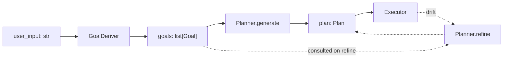

# Goals and plans

goldfive separates two concepts that most agent frameworks conflate:

- **Goals** — what "done" means. Explicit, small in number, surfaced
  to the planner and the drift classifier.
- **Plans** — the DAG of tasks that, if executed, achieves the goals.

This guide covers the split, when to author a custom `GoalDeriver` or
`Planner`, and how `refine` works in practice.

Related: [PROTOCOLS.md](../design/PROTOCOLS.md#goalderiver),
[PROTOCOLS.md](../design/PROTOCOLS.md#planner),
[DRIFT.md](../design/DRIFT.md).

## The shapes

```python
@dataclasses.dataclass
class Goal:
    id: str
    summary: str
    success_predicate: Optional[Callable[["Session"], bool]] = None
    metadata: dict[str, str] = dataclasses.field(default_factory=dict)


@dataclasses.dataclass
class Plan:
    id: str
    run_id: str
    goal_ids: list[str]
    tasks: list[Task]
    edges: list[TaskEdge]
    summary: str = ""
    revision_reason: str = ""
    revision_kind: str = ""
    revision_severity: str = ""
    revision_index: int = 0
```

A `Goal` is tiny on purpose. The `summary` is a natural-language
one-liner; the optional `success_predicate` lets the caller encode
"are we done?" as code rather than prose.

A `Plan` is a DAG: a list of `Task`s plus `TaskEdge`s between them.
`Plan.topological_stages()` returns the tasks grouped by dependency
depth — that's what the executors walk.

## Why the split

Historically (and in most agent libraries today), the planner sees
the raw user message and returns a task list. That works for
demos but fails on real workloads for two reasons:

1. **Goal drift is indistinguishable from plan drift.** If the only
   representation of "what the user wanted" is the user message
   verbatim, the planner can't tell whether a mid-run steer is
   "same goal, different plan" or "different goal entirely".
2. **Success predicates have nowhere to live.** You can't attach a
   "did we actually achieve this" check to "write me a slide deck"
   without a goal object to attach it to.

goldfive's answer: **derive an explicit `list[Goal]` up-front, treat
the plan as a derivative of the goals, and measure drift against the
goals, not the plan.**

## The default flow



- `GoalDeriver` runs once, at the top of `Runner.run()`.
- `Planner.generate` runs once, after goals.
- `Planner.refine` runs once per drift escalated to ABSORB (Level 1+)
  by the steerer's intervention ladder. Same-kind drifts within
  `DEFAULT_REFINE_THROTTLE_SECONDS` collapse into one refine call;
  CRITICAL severities bypass the throttle.

Goals accumulate across USER_STEER interventions (goldfive#154): each
user steer appends a goal with `source=GOAL_SOURCE_USER_STEER`. These
are "sticky" — `LLMPlanner.refine` rejects revisions that silently
drop them, so later drifts cannot unwind an operator's steer by
merely refining around it.

Plans change whenever refine returns a non-None plan.

## GoalDerivers

### `PassthroughGoalDeriver`

The default when the caller passed a `list[Goal]` directly to
`runner.run(...)`, or when goldfive is embedded in a system that
already has an explicit goal representation.

```python
from goldfive.goal_deriver import PassthroughGoalDeriver
from goldfive.types import Goal

goals = [
    Goal(id="g1", summary="ship the feature"),
    Goal(id="g2", summary="write the docs"),
]
runner = Runner(
    agent=...,
    planner=...,
    executor=...,
    goal_deriver=PassthroughGoalDeriver(goals),  # deriver is bypassed anyway
)
await runner.run(goals)  # list[Goal] directly — deriver is not consulted
```

`PassthroughGoalDeriver` requires a seed (``str``, ``list[str]``, or
``list[Goal]``) so it can still serve ``derive()`` if anything calls
it. When ``Runner.run`` receives a ``list[Goal]`` directly, the
deriver is bypassed entirely, so what you pass as the seed is largely
cosmetic.

### `LLMGoalDeriver`

Uses an LLM to extract explicit goals from prose user input. Useful
when goldfive is the top of a product stack and the user is typing
natural language.

```python
from goldfive.goal_deriver import LLMGoalDeriver


async def call_llm(system_prompt: str, user_prompt: str, model: str) -> str:
    # your LLM wrapper goes here
    ...


runner = Runner(
    agent=...,
    planner=...,
    executor=...,
    goal_deriver=LLMGoalDeriver(call_llm, model="claude-opus-4-5"),
)
```

The LLM sees the user input plus a short system prompt asking for a
JSON array of goals with `id` and `summary`. Fence-stripping and JSON
parsing follow the same pattern as `LLMPlanner`.

### Writing a custom GoalDeriver

One method to implement:

```python
from __future__ import annotations

from typing import Any, Mapping, Optional

from goldfive.types import Goal


class MyGoalDeriver:
    async def derive(
        self,
        user_input: str,
        *,
        context: Optional[Mapping[str, Any]] = None,
    ) -> list[Goal]:
        # your logic here
        return [Goal(id="g1", summary=user_input.strip())]
```

When to write one:

- Your product has a structured input form (not free-text) and you
  want to map fields onto goals directly without an LLM hop.
- You want to enforce business invariants on goals (maximum count,
  forbidden content, required `success_predicate`s).
- You're integrating with an upstream product that already produces a
  goal-like object.

Keep the deriver small. Complex logic belongs further down the stack.

## Planners

### `PassthroughPlanner` and `StaticPlanner`

```python
from goldfive.planner import PassthroughPlanner, StaticPlanner

# PassthroughPlanner is a no-op: generate() and refine() both return
# None. Useful as a default when planning is opt-in.
planner = PassthroughPlanner()

# StaticPlanner hands a pre-built plan back from generate() verbatim
# (with run_id / goal_ids stamped onto the returned copy).
planner = StaticPlanner(precomputed_plan)
```

Use ``PassthroughPlanner`` when planning is opt-in and a no-op is
acceptable. Use ``StaticPlanner`` for tests, demos, and cases where
you're authoring plans ahead of time. Both return ``None`` from
``refine()`` — they don't mutate the plan in response to drift.

### `LLMPlanner`

```python
from goldfive.planner import LLMPlanner


async def call_llm(system_prompt: str, user_prompt: str, model: str) -> str:
    ...


planner = LLMPlanner(
    call_llm=call_llm,
    model="claude-opus-4-5",
    system_prompt=None,          # optional override for goal→plan prompt
    refine_system_prompt=None,   # optional override for refine prompt
)
```

The LLM sees the goals, available agents, and (on refine) the current
plan and drift event. It returns a JSON plan. `LLMPlanner` strips
markdown fences, parses, validates the shape, and returns a `Plan`
(or `None` on parse failure or refusal).

### Writing a custom Planner

Two methods to implement:

```python
from __future__ import annotations

from typing import Any, Mapping, Optional

from goldfive.types import DriftEvent, Goal, Plan, Task, TaskEdge


class MyPlanner:
    async def generate(
        self,
        *,
        goals: list[Goal],
        available_agents: list[str],
        context: Optional[Mapping[str, Any]] = None,
    ) -> Optional[Plan]:
        # one task per goal, assigned to the first available agent
        tasks = [
            Task(
                id=f"t-{i}",
                title=g.summary[:80],
                description=g.summary,
                assignee_agent_id=available_agents[0],
            )
            for i, g in enumerate(goals)
        ]
        return Plan(
            id="my-plan",
            run_id="",  # Runner stamps this
            goal_ids=[g.id for g in goals],
            tasks=tasks,
            edges=[],
        )

    async def refine(
        self,
        *,
        plan: Plan,
        drift: DriftEvent,
        goals: list[Goal],
    ) -> Optional[Plan]:
        return None  # never refine
```

When to write one:

- You have strong domain structure and an LLM would just get in the
  way (e.g. you know the exact workflow for every goal type).
- You want to enforce plan constraints the LLM would violate
  (budget caps, agent availability, task templates).
- You want a hybrid: deterministic skeleton, LLM fills in details.

### The refine contract (important)

`refine(plan, drift, goals, *, observed_actions=None)` must:

1. **Preserve completed tasks verbatim.** The executor will skip any
   task in a terminal state, but the revised plan should still list
   them so downstream plan-diff consumers (sinks, UIs) can see the
   full history. `Plan.validate(for_revision=True, prior=plan)`
   enforces this (PLAN-LIFECYCLE §3.1 — terminal task preservation;
   §3.2 — terminal→terminal edge preservation).
2. **Honor sticky goals.** Goals whose `source == GOAL_SOURCE_USER_STEER`
   (goldfive#154) must be represented in the revised plan. A refine
   that silently drops a user-steer goal is rejected by the
   `LLMPlanner` and triggers a `REFINE_VALIDATION_FAILED` drift.
3. **Leave the plan semantically sensible even if the drift is
   garbage.** If you can't do anything useful with the drift, return
   `None`. `None` is a legitimate signal that means "I can't revise".
4. **Increment `revision_index` and stamp `revision_reason`.** The
   executor stamps these for you after `refine()` returns, but a
   custom planner can pre-populate them if it's doing its own
   tracking.
5. **Optionally consume `observed_actions`** — the overlay-model
   reconciler (goldfive#141) builds a list of `ObservedAction`
   snapshots per invocation and hands them to refine when the drift
   kind is `PLAN_DIVERGENCE` (goldfive#144). Each entry carries
   agent name, invocation id, timestamps, status, and a short
   summary, letting the planner compare planned dispatch against the
   observed tree execution.

A skeleton refine:

```python
async def refine(
    self,
    *,
    plan: Plan,
    drift: DriftEvent,
    goals: list[Goal],
) -> Optional[Plan]:
    # Start from the current plan, preserving completed tasks.
    preserved = [t for t in plan.tasks if t.status == TaskStatus.COMPLETED]
    remaining = [t for t in plan.tasks if t.status != TaskStatus.COMPLETED]

    if drift.kind == DriftKind.NEW_WORK_DISCOVERED:
        # append the newly discovered task
        new_task = Task(
            id=f"t-new-{len(plan.tasks)}",
            title=drift.detail[:80],
            assignee_agent_id=drift.current_agent_id or "default",
        )
        return Plan(
            id=plan.id,
            run_id=plan.run_id,
            goal_ids=plan.goal_ids,
            tasks=preserved + remaining + [new_task],
            edges=plan.edges,  # copy forward; add edge from parent if applicable
        )

    if drift.kind == DriftKind.TASK_FAILED_RECOVERABLE:
        # drop the failed task's remaining pending children;
        # the planner may re-plan how to achieve the original goal
        ...

    return None  # couldn't handle this drift kind
```

See [DRIFT.md](../design/DRIFT.md) for the full kind list.

## Success predicates

A `Goal` can carry an optional `success_predicate: Callable[[Session], bool]`.
Both bundled executors consult it at end-of-run: once every task is
terminal (and no orphans remain), `evaluate_goal_predicates`
(`goldfive/results.py`, PLAN-LIFECYCLE.md §6.1 third clause) evaluates
every goal's predicate in order. The first predicate that returns
`False` — or raises; a crashing predicate is never a pass — fails the
run with `success=False` and a descriptive `reason` on the
`ExecutionOutcome` (and a matching `RunAborted`). `None` predicates
are vacuously met. The contract is that the predicate is pure and
cheap.

A typical use:

```python
def deck_is_ready(session: Session) -> bool:
    return "deck_url" in session.completed_results.values()

goal = Goal(
    id="g1",
    summary="build a Python slide deck",
    success_predicate=deck_is_ready,
)
```

There is no mid-run consultation: the predicate is only evaluated at
the end-of-run gate. A future version may consult it between tasks
and fire `GOAL_UNREACHABLE` drift if the plan hasn't made progress
toward it after N tasks (the enum value exists; nothing emits it
today).

## Tuning the LLM planner prompts

`LLMPlanner` exposes two overrides: `system_prompt` and
`refine_system_prompt`. The shipped prompts are in
`goldfive/planner.py` under `_DEFAULT_SYSTEM_PROMPT` and
`_REFINE_SYSTEM_PROMPT`. Port what you need from those; they're tuned
for the JSON output format the parser expects.

The default output shape (in the prompt):

```json
{
  "summary": "short description of the plan",
  "tasks": [
    {"id": "t1", "title": "...", "description": "...", "assignee_agent_id": "..."},
    {"id": "t2", "title": "...", "description": "...", "assignee_agent_id": "..."}
  ],
  "edges": [
    {"from_task_id": "t1", "to_task_id": "t2"}
  ]
}
```

If you need to change this shape, subclass `LLMPlanner` and override
the parser. Don't change the prompts without changing the parser —
they're matched.

## Recommended recipes

**Structured input → one task per form field.** Use
`PassthroughGoalDeriver` or a custom deriver that maps form state onto
`Goal`s, and a custom `Planner` that issues a task per goal.

**Free-text input → LLM-derived goals, LLM-planned execution.** Use
`LLMGoalDeriver` + `LLMPlanner`. Default combo for general assistants.

**Fixed workflow, variable details.** Use `StaticPlanner` with a
plan template cloned per run, populated with the run-specific goal
summaries.

**Multiple possible strategies per goal.** Keep `PassthroughGoalDeriver`
but write a custom planner that chooses a strategy based on metadata
on the goal.

## Anti-patterns

- **Using goals as tasks.** A `Goal.summary` is a one-liner; a `Task`
  has an assignee, a description, and is a unit of agent work.
  Don't blur them.
- **Calling `planner.refine()` from your own code.** Refine is the
  executor's responsibility. If you want to force a replan from
  outside, synthesize a `DriftEvent(kind=USER_STEER)` and hand it to
  the steerer.
- **Returning an unchanged plan from `refine()`.** Return `None`
  instead. The executor handles `None` specifically (no plan change,
  continue) and treats a non-None return as "the plan has changed".
