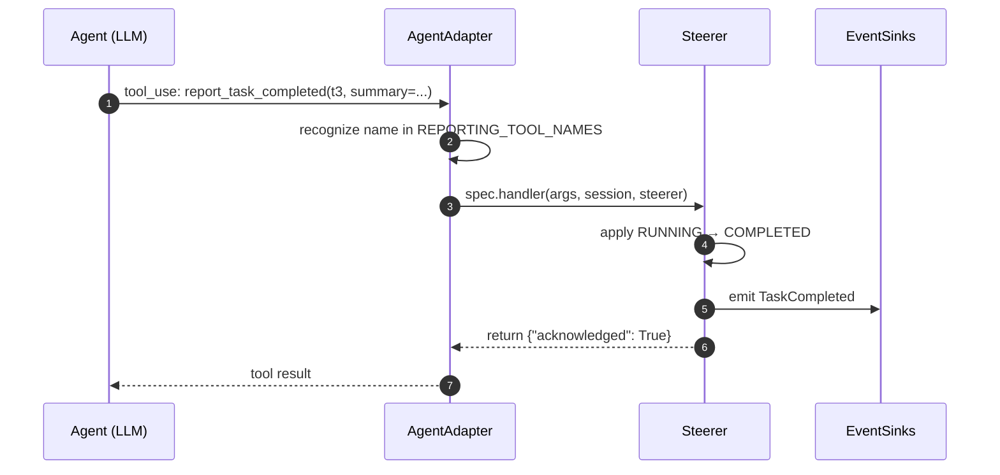

# Reporting tools reference

goldfive injects a small set of **reporting tools** into every agent
wrapped by an `AgentAdapter`. These are how the agent explicitly
communicates task state to the orchestrator — not inferred from span
lifecycle, not guessed from prose, always called out.

The tool *bodies* are trivial; each one returns
`{"acknowledged": True}`. The real work happens in the adapter's
interception path: when the agent calls `report_task_completed(...)`,
the adapter routes it through the spec's handler, which invokes the
steerer, which applies the state transition and emits an event.

Related: [STATE-MACHINE.md](../design/STATE-MACHINE.md),
[PROTOCOLS.md](../design/PROTOCOLS.md#agentadapter),
[writing-an-agent-adapter.md](../guides/writing-an-agent-adapter.md).

## The `ReportingToolSpec` shape

```python
@dataclasses.dataclass
class ReportingToolSpec:
    name: str
    description: str
    parameters: dict[str, Any]   # JSON schema for parameters
    handler: Callable[
        [dict[str, Any], "Session", "Steerer"],
        Awaitable[dict[str, Any]],
    ]
```

An `AgentAdapter` receives a list of these from
`register_reporting_tools(tools)` at setup time and installs them in
whatever form its framework expects.

## When to call each

Agents should call reporting tools at **task boundaries**, not from
general chit-chat. The sub-agent instruction appendix wired in by
goldfive gives models the minimum contract:

```
When you are working on a planned task:
- Call report_task_started(task_id) before beginning work
- Call report_task_completed(task_id, summary=...) after finishing
- If you discover additional work, call report_new_work_discovered(...)
- If you fail, call report_task_failed(task_id, reason=...)
- If you are stuck on an external blocker, call
  report_task_blocked(task_id, blocker=...)
```

The current `task_id` is made available to the agent by the adapter —
either in a shared session-state dict (ADK), a system prompt (Claude
SDK), or as a direct argument (CallableAdapter).

## The seven tools

Names are stable contract — do not rename. Mirrors harmonograf's
canonical reporting tools; goldfive owns the list from v0.1 forward.

### 1. `report_task_started`

```python
report_task_started(task_id: str, detail: str = "") -> dict
```

**Call when:** about to begin work on a planned task.

**Side effects:**

- Steerer transitions `task_id` to RUNNING (unless the task is
  already in a terminal status, in which case the call is a no-op).
- `session.current_task_id = task_id`.
- `session.agent_notes[task_id] = detail` when `detail` is non-empty.
- Emits `TaskStarted(task_id, detail)`.

**Example:**

```python
# inside an agent callable or LLM tool call
await report_task_started(task_id="t3", detail="starting research phase")
```

### 2. `report_task_progress`

```python
report_task_progress(
    task_id: str,
    fraction: float = 0.0,
    detail: str = "",
) -> dict
```

**Call when:** a long-running task has meaningful sub-steps to
announce. Optional; not required for correct operation.

**Side effects:**

- `session.task_progress[task_id] = fraction` (clamped to `[0.0, 1.0]`).
- `session.agent_notes[task_id] = detail` when `detail` is non-empty.
- Emits `TaskProgress(task_id, fraction, detail)`.
- **No state transition.**

**Example:**

```python
await report_task_progress(
    task_id="t3",
    fraction=0.5,
    detail="draft complete; beginning polish",
)
```

Sinks use progress events for liveness indicators. goldfive itself
does not consume `fraction` — a stalled task is detected via elapsed
time against `task.predicted_duration_ms`, not via progress gaps.

### 3. `report_task_completed`

```python
report_task_completed(
    task_id: str,
    summary: str,
    artifacts: dict[str, str] | None = None,
) -> dict
```

**Call when:** the task is done. This is terminal.

**Side effects:**

- Steerer transitions `task_id` to COMPLETED (no-op if already
  terminal).
- `session.completed_results[task_id] = summary`. Downstream tasks
  see this in their context.
- Emits `TaskCompleted(task_id, summary, artifacts)`.

**Example:**

```python
await report_task_completed(
    task_id="t3",
    summary="slide deck generated with 5 slides, saved to deck.pptx",
    artifacts={"deck_url": "s3://bucket/deck.pptx"},
)
```

The `artifacts` map is free-form `str → str`. Typical uses: URLs,
content hashes, IDs. Sinks surface artifacts to the user; goldfive
itself treats the map as opaque.

### 4. `report_task_failed`

```python
report_task_failed(
    task_id: str,
    reason: str,
    recoverable: bool = True,
) -> dict
```

**Call when:** the task cannot complete.

**Side effects:**

- Steerer transitions `task_id` to FAILED (no-op if already terminal).
- Emits `TaskFailed(task_id, reason, recoverable)`.
- Fires `DriftEvent(kind=TASK_FAILED_RECOVERABLE, severity=warning)`
  if `recoverable=True`.
- Fires `DriftEvent(kind=TASK_FAILED_FATAL, severity=critical)` if
  `recoverable=False`; the executor runs the unrecoverable cascade.

**Example:**

```python
await report_task_failed(
    task_id="t3",
    reason="API returned 503 after 3 retries",
    recoverable=True,
)
```

`recoverable=False` should be reserved for truly unrecoverable
situations — the plan cannot proceed regardless of refine. Use
sparingly.

### 5. `report_task_blocked`

```python
report_task_blocked(
    task_id: str,
    blocker: str,
    needed: str = "",
) -> dict
```

**Call when:** an external condition prevents progress but the task
hasn't failed. Examples: awaiting a human approval, waiting on an
asynchronous external process, rate-limited.

**Side effects:**

- Steerer transitions `task_id` to BLOCKED (no-op if already terminal).
- `session.agent_notes[task_id]` captures a `"blocked: <blocker>"`
  message (and `(needed: <needed>)` when `needed` is non-empty).
- Emits `TaskBlocked(task_id, blocker, needed)`.
- Fires `DriftEvent(kind=BLOCKED, severity=warning)` which flows
  through the standard drift pipeline (≥ WARNING → `planner.refine`).

**Example:**

```python
await report_task_blocked(
    task_id="t3",
    blocker="awaiting user approval for destructive action",
    needed="human confirmation via the approval queue",
)
```

### 6. `report_new_work_discovered`

```python
report_new_work_discovered(
    parent_task_id: str,
    title: str,
    description: str,
    assignee: str = "",
) -> dict
```

**Call when:** during work on `parent_task_id`, the agent realizes a
new task exists that wasn't in the plan and is required for the
parent to complete.

**Side effects:**

- Fires `DriftEvent(kind=NEW_WORK_DISCOVERED, severity=warning)` with
  the new task's metadata attached to `drift.raw`.
- The executor triggers `planner.refine(...)`; the planner is
  expected to return a revised plan that adds the new task as a child
  of `parent_task_id`.
- Emits nothing directly (the `DriftDetected` and eventual
  `PlanRevised` events cover it).
- Task state is unchanged; the parent task keeps RUNNING.

**Example:**

```python
await report_new_work_discovered(
    parent_task_id="t2",
    title="fetch corporate branding",
    description="download the company logo SVG for slide 1",
    assignee="web_developer",
)
```

### 7. `report_plan_divergence`

```python
report_plan_divergence(
    note: str,
    suggested_action: str = "",
) -> dict
```

**Call when:** the whole plan no longer matches reality. This is
stronger than "new work exists" — it's "the current plan is wrong
top-to-bottom".

**Side effects:**

- `session.divergence_flag = True`.
- Fires `DriftEvent(kind=PLAN_DIVERGENCE, severity=warning)` with
  `note` and `suggested_action` as hints for the planner.
- Triggers refine.

**Example:**

```python
await report_plan_divergence(
    note="the user changed their mind — they want a podcast, not a deck",
    suggested_action="scrap t2–t5; start over with audio production tasks",
)
```

Use sparingly. Most drift should route through the more specific
tools above; `report_plan_divergence` is the catch-all.

## Summary table

| Tool | Signature | Transition | Drift kind |
|---|---|---|---|
| `report_task_started` | `(task_id, detail="")` | PENDING → RUNNING | — |
| `report_task_progress` | `(task_id, fraction=0.0, detail="")` | RUNNING → RUNNING | — |
| `report_task_completed` | `(task_id, summary, artifacts=None)` | RUNNING → COMPLETED | — |
| `report_task_failed` | `(task_id, reason, recoverable=True)` | RUNNING → FAILED | `TASK_FAILED_RECOVERABLE` or `TASK_FAILED_FATAL` |
| `report_task_blocked` | `(task_id, blocker, needed="")` | RUNNING → BLOCKED | `BLOCKED` |
| `report_new_work_discovered` | `(parent_task_id, title, description, assignee="")` | none | `NEW_WORK_DISCOVERED` |
| `report_plan_divergence` | `(note, suggested_action="")` | none | `PLAN_DIVERGENCE` |

## How the interception works

Every adapter implements this flow:



The tool body never actually runs arbitrary code — it returns
`{"acknowledged": True}` synchronously. The interception in the
adapter is what makes anything happen.

This design means agents can call reporting tools like any other
tool, without knowing goldfive exists. The state transitions happen
behind the scenes.

## Why not infer state from spans?

Earlier iterations of this protocol (in harmonograf before the
extraction) inferred task state from span lifecycle and from prose
markers like "Task complete:" in the LLM response. That broke down
for three reasons:

1. **Long-running tool calls** looked "done" the moment the outer
   LLM stopped, even when they were still working.
2. **Prose parsing** couldn't distinguish "I will complete the task"
   from "task complete".
3. **Concurrent sub-agents** racing through a parallel plan produced
   ordering bugs because state transitions lived in two places at
   once.

Reporting tools make the state machine **explicit and monotonic**:
one call, one transition, one source of truth.

Agents that narrate in prose instead of calling tools still work,
degraded — the `Steerer.observe()` path scans streamed content for
structured signals as a belt-and-suspenders. But explicit tools are
the canonical protocol, and anyone writing a new adapter should
prefer them.

## Customizing the tool list

The seven tools above are the minimum contract. Custom adapters can
extend the list by appending to `tools` before calling
`adapter.register_reporting_tools(tools)`. The steerer ignores names
it doesn't recognize, so custom tools pass through to the framework's
normal tool-call path. A typical extension: domain-specific reporting
tools like `report_budget_remaining` or `report_confidence`.

Renaming or removing the seven canonical tools is not supported.
Downstream consumers (harmonograf, planners, sinks) pattern-match on
the canonical names.
